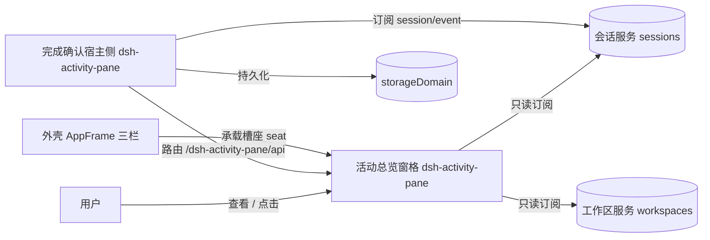
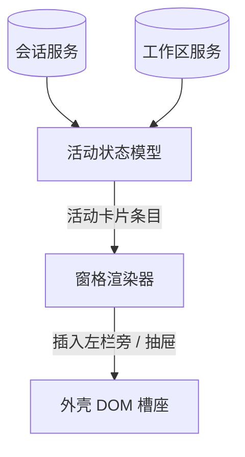
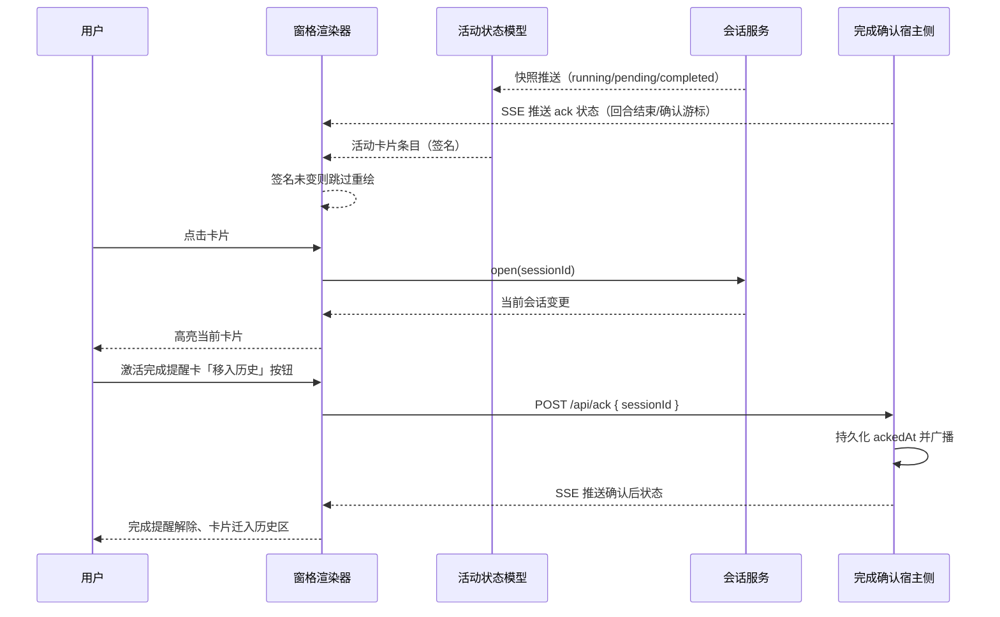
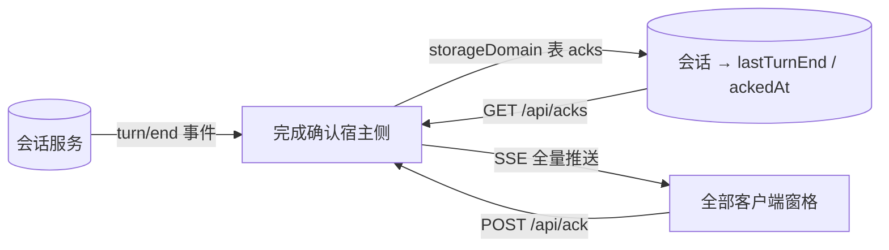
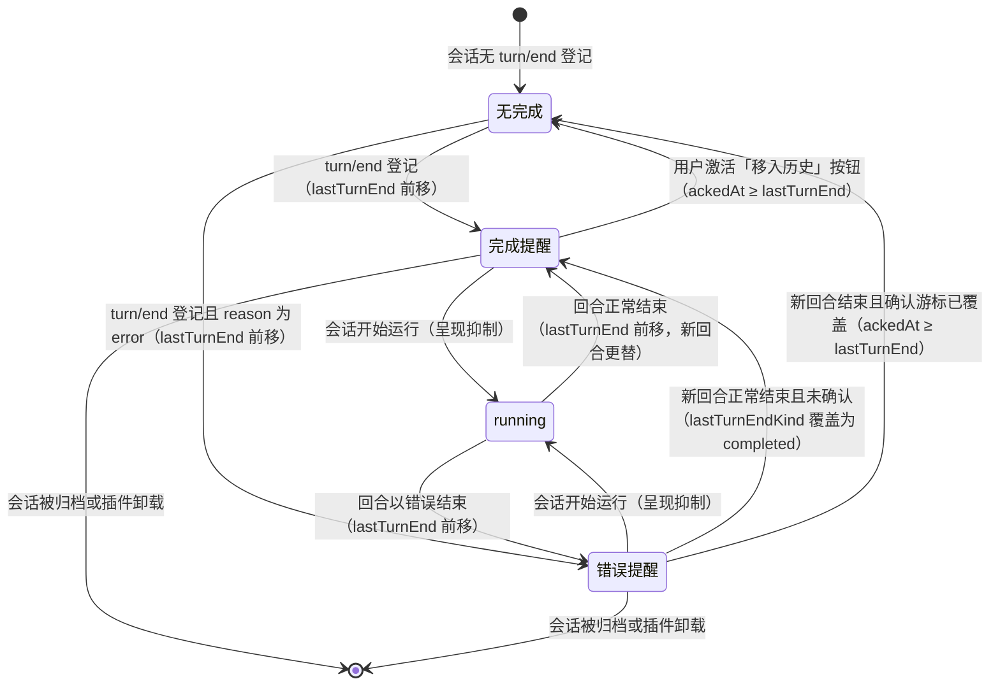
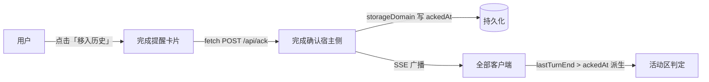

# DESIGN — 活动会话总览窗格

## 架构视图清单

| 视图 | 适用性/理由 | 图表位置 |
|---|---|---|
| 系统上下文 | 适用：窗格与用户、外壳三栏、会话/工作区服务存在明确边界 | 系统上下文图 |
| 一级静态分解 | 适用：需要说明两个主要运行单元（状态模型与渲染器）及其依赖 | 一级静态分解图 |
| 内部组件分解 | 不适用：两个单端 JS 模块，无更细的内部组件 | — |
| 运行时交互 | 适用：快照变化到卡片重绘、卡片激活到会话切换具有代表性时序 | 运行时交互图 |
| 数据与领域模型 | 适用：完成确认状态为宿主侧插件持久化模型（sessionId → 回合结束/确认游标），经 SSE 通道下发 | 数据与领域模型图 |
| 状态与生命周期 | 适用：完成确认有明确生命周期（回合结束登记 → 保持 → 显式确认或新回合隐式更替解除），其余状态一律来自宿主快照 | 状态与生命周期图 |
| 数据流与信任边界 | 适用：确认按钮是窗格首个写回路径，属同一宿主进程内的受信读写 | 数据流与信任边界图 |
| 部署 | 不适用：插件随宿主 web 打包分发，无可独立部署拓扑 | — |
| 分层与依赖 | 不适用：仅有单个浏览器 bundle，无分层约束 | — |
| 系统景观 | 不适用：单插件产品，不构成多系统平台 | — |

## 设计细化清单

| 关注面 | 适用性/理由 | 设计落点 |
|---|---|---|
| 边界与对外契约 | 适用：窗格与外壳 DOM、会话/工作区服务有明确契约 | DESIGN.md#边界与对外契约 |
| 核心数据与不变量 | 适用：活动条目模型与显示过滤是核心不变量 | DESIGN.md#核心数据与不变量 |
| 状态与生命周期 | 适用：完成确认有明确生命周期（回合结束登记 → 保持 → 显式确认或新回合隐式更替解除），其余状态一律来自宿主快照 | DESIGN.md#核心数据与不变量 |
| 运行时、并发与失败语义 | 适用：渲染去重、打开重试与卸载清理有明确语义 | DESIGN.md#运行时、并发与失败语义 |
| 外部集成 | 适用：宿主侧集成（session/event 事件、webServer 路由、storageDomain 持久化）| DESIGN.md#完成确认宿主侧 |
| 配置与可变点 | 适用：桌面列宽为用户可调（右缘拖拽 200–480px，localStorage 持久化）；移动断点仍为代码常量 | DESIGN.md#边界与对外契约 |
| 安全与信任边界 | 不适用：只读宿主快照，不处理敏感数据、不引入外部资源 | — |
| 部署、迁移与恢复 | 不适用：随宿主 web 打包分发，无独立部署/迁移语义 | — |
| 兼容性与版本演进 | 不适用：新项目无既有兼容契约，依赖外壳稳定槽座 | — |
| 可观测性与运维 | 不适用：无独立运行时可观测面，卸载可逆即恢复语义 | — |

## 实现就绪检查

| 条件 | 结论 | 证据或落点 |
|---|---|---|
| 边界与契约已明确 | 通过 | DESIGN.md#边界与对外契约 |
| 关键不变量已明确 | 通过 | DESIGN.md#核心数据与不变量 |
| 重大设计选择已收敛 | 通过 | C-028、C-030 等已记入 DECISIONS.md |
| 目标实现归属已明确 | 通过 | DESIGN.md#子系统与模块 |
| 现状差距已有 task 承接 | 通过 | 运行卡向 answer-pet 富化（摘要/token/速率/进度/流程节点）由 T-002 承接（见 tasks/），已授权的目标差距 |
| 可派生验证 | 通过 | CONVENTIONS.md#验证门禁 |

## 静态架构

### 系统上下文图

### 一级静态分解图

## 运行时视图

### 运行时交互图

### 数据与领域模型图

### 状态与生命周期图

### 数据流与信任边界图

## 边界与对外契约

- 对外只读（例外：完成确认）：窗格只消费 DSH 原生 `sessions` / `workspaces` 客户端服务、可选的 `modelDirectories` 模型目录服务（缺失时回落，见模型上下文条目）及其 native `connection.api` 的一次性历史/模型读取；唯一写回路径是完成提醒卡确认按钮（展示文案「移入历史」）经宿主侧 HTTP 路由 `/dsh-activity-pane/api/ack` 写回确认游标（R-02-001、R-02-003、R-01-002/AC-10）；不发起第三方 HTTP 状态轮询。
- 宿主依赖：窗口宿主为外壳三栏的中间列（`#root [data-slot="conversation"]` 的父级）。桌面下窗格作为该列内**真实的 flex 行元素**（插于会话座之前）占据左侧列宽（默认 280px，可经右缘手柄拖拽在 200–480px 内调整），会话根被设为 `flex:1 1 0%` 弹性填充余宽——主会话内容（标题/tabs/滚动区/输入框）随窗格展开与调宽随之让位、随折叠（窄条）同步恢复，而非被浮层覆盖（R-01-007、R-01-011、R-01-015）。
- 移动端：抽屉以 `position:fixed` 脱离文档流，不改变主会话布局；中间列恢复外壳默认列布局（R-01-008）。抽屉打开时显示透明全屏遮罩，z-index 介于主会话与抽屉之间，点击遮罩收起抽屉；遮罩完全透明、不占布局（R-01-008/AC-03）。浮动开关固定于会话头部左上角（`top:12px; left:44px`，即原生左边栏切换按钮右侧），文案为「活动」；抽屉打开时开关随之隐藏，关闭后恢复（R-01-008/AC-04、AC-05）。
- 页面契约：点击/键盘激活活动卡片 → 调用 `sessions.open` 切换当前会话；列表未就绪时以 `sessions.refresh` + 有限重试兜底（R-01-005）。
- 卸载契约：移除注入的窗格元素、浮动开关、透明遮罩、样式与全部事件监听，复位对中间列/会话根的布局改写，不残留（R-02-003、R-02-004）。
- 关键机制：
  - 不依赖任何第三方宠物插件，也不向第三方数据路由发请求（R-02-001）。
  - 移动端抽屉不改变主会话布局，离开文档流（R-01-008）。
  - 双区结构：窗格内容区分为上「活动会话」下「最近历史」，两者都由同一快照派生；最近历史仅主会话（R-01-010）。
  - 完成确认与迁移动画：完成确认状态由宿主侧持久化承载——宿主侧订阅 `session/event` 把每个主/子会话的 `turn/end`（取事件顶层 `time`，并记录 `data.reason.kind` 与 error 回合的错误信息）登记为最新回合结束时刻 `lastTurnEnd` 与结束原因 `lastTurnEndKind`/错误信息 `lastTurnEndError`；确认按钮经 HTTP 路由写回 `ackedAt`；完成提醒成立 = 主会话 && 非 running && 无阻塞等待 && 非委托周期 && `lastTurnEnd > ackedAt`，错误提醒成立 = 主会话 && 非 running && 无阻塞等待 && 非委托周期 && `lastTurnEndKind === 'error'`（不消费 ack 游标），由渲染器从 SSE 通道的 ack 状态派生（R-01-002/AC-03、AC-05、AC-10～AC-13、R-01-010/AC-06）。任一卡片在活动区与历史区之间迁移（双向）时，渲染器以相邻两帧活动区/历史区 id 集合差检测迁移，用旧卡克隆 ghost（挂于窗格内、继承卡片样式作用域）从原矩形 FLIP 平移并形变至目标区卡片矩形，到位后淡出、真卡同步淡入，`transitionend` 收口移除 ghost；迁移导致位置变化的其它卡片（含历史区段头）同样以 FLIP 平移平滑过渡到新位置，不瞬间跳变；`prefers-reduced-motion` 或目标矩形不可量取时跳过动画直接落位（R-01-002/AC-05、R-01-010/AC-06、AC-07、AC-10）。
  - 轮内状态通过 `sessions.binding(sessionId).session` 订阅运行中会话取得，随运行结束断开；token 统计（计费输入/输出/缓存命中率）与速率取 `sessions.list` 条目的 `projectionValues`（`tokenUsage` / `sessionStats`，复用既有列表订阅，无新增轮询）；运行时长与进度在渲染期按回合开始时间实时计算（R-01-009、R-02-004）。
  - 工作项数据优先从原生 `ConversationSnapshot.chat` 的 `order` / `nodes` 读取，按主会话窗口实际显示顺序派生并折叠为分组呈现；冷会话使用 native `sessions.history` 读取补齐：尾页取不到最近用户消息时按 `beforeSeq` 向前回溯翻页（默认无页数上限，一直翻到命中最近一条用户消息或翻尽为止——用户消息必然存在于会话最早段，翻尽必终止；实证约 28% 会话的最后用户消息距尾部超 150 事件，固定 3 页上限会让历史卡用户预览永久缺失；`maxPages` 保留为显式护栏），不克隆第三方 UI 路由；预览提取（`messagePreviews`）对多页组合的事件按尾部反向扫描取最近命中；最近卡窗口快照缺用户或 agent 任一预览时补读一次 history，避免完成瞬间窗口仅含用户消息而把 agent 预览永久留空（R-01-013/AC-03、AC-04）。运行中当前项由原生 `session.subscribe` 推送刷新（R-01-012）。同一 history 读取顺带提取最后 `turn/end` 时刻，供历史区时间精化（R-01-010/AC-08、AC-09）。冷窗口兜底：快照已就绪但加载窗口缺锚点数据（超长回合的 `turn/start` 或可锚用户行在尾页窗口之外，页面刷新/断连重装窗口后出现）时仍补读一次 history——回合起点缺口口径为「宿主运行中 + 轮内订阅已建立 + 快照无窗口内起点」（`openTurnStartMissing`，等待/空闲会话不算缺口），缺口会话回溯至命中开放回合 `turn/start`（用户消息命中但起点未命中时继续回溯，同样以翻尽为终），供进度锚点（`openTurnStartFromEvents`）与指令锚行（`historyInstructionAnchor` 作 `fallbackAnchor`）兜底（R-01-009/AC-06、R-01-012/AC-12）。
  - 模型上下文：初值仍由 native `sessions.models` 一次性读取提供；同时为每个可见主会话订阅可选 `modelDirectories` 服务的 per-session 目录 store（与主会话窗口模型选择器同源，同客户端切换模型选择经 `select()` 成功即推送），推送到达即按当前选择与 catalog metadata 重归一并就地更新卡片；服务缺失、会话无 scope 或订阅失败时不订阅，保持一次性读取行为。目录 store 只订阅不 `load()`——不扰动其 generation 状态机，初值与失败语义完全沿用一次性读取路径。模型名称与 reasoning level 缺失时保持空值；不使用 `agentPreset` 冒充模型（R-01-012/AC-01、AC-16，C-024）。
  - 富卡统计：运行卡展示工具动作摘要、底部统计行与阶段进度——统计行左列依次为 tok/s 输出速率（不带近似符号）、缓存命中率、计费输入 token、输出 token，与会话主窗口统计行同序，字段间以小圆点区隔，本回合时长固定显示于该行最右（R-01-009）；动作摘要由 `summarizeToolArguments` 按主会话窗口同一语义派生（分工具类型参数键、bash 含 command、无命中取首个字符串参数值、剥离工作区前缀、取首行）后上卡（R-01-009）。
  - 运行卡外观沿用 answer-pet 的卡片质感。
    - 工作项时间线从卡片内容左边界起步，竖线与圆点严格同圆心；当前节点圆点带半透明外环并闪烁。
    - 进度行由可伸缩的 5px 圆角进度条与其右侧固定宽百分比组成，两者同行；百分比在固定占位内右对齐，其文字右缘与下一行最右侧耗时文字右缘对齐，并以不改变布局占位的方式相对进度条中心上移 1px；会话运行期间填充持续呈现向右滚动条纹，作为活动标志（R-01-009/AC-06、AC-08）。
    - 卡片不渲染独立当前动作状态行。
    - 工作项标题与摘要之间显示小圆点；用户项使用人物图标并带「用户」标签（R-01-012/AC-05）。
    - 错误所在分组行整体染为错误红色；含 Bash 的分组行使用稳定的命令图标，不读取展开态下的 disclosure 箭头（R-01-009/AC-02、AC-08、AC-09；R-01-012/AC-03～AC-08）。
  - 徽标计数与脉冲提醒：列头/窄条/移动端开关的数量徽标由 buildEntries 条目单点派生——分子为等待行动（awaiting）主会话数、分母为其加 running 主会话之和（`awaitBadgeStats`），子代理不计入；空态同样以「0/0」呈现。存在等待行动时徽标以与等待卡完全一致的背景色与透明度呈现（列头/窄条/移动端开关三处徽标均无描边与外环），底色动态跟随等待构成且按错误 > 阻塞 > 完成 优先级取色——存在错误提醒主会话时取错误提醒卡同款红色，否则存在阻塞等待主会话时取阻塞等待卡同款金色，等待行动全部为完成提醒时取完成提醒卡同款绿色（R-01-002/AC-06）；并以固定 1.2s 亮度呼吸脉冲提示——脉冲表达「有会话等你行动」，三类等待行动同等提醒；脉冲不改整体不透明度，避免半透明底透进列头背景。渲染层只写文本、`data-awaiting` 与徽标 tone；等待条目 id/类别集合或当前可见数量胶囊表面（列头/窄条/移动按钮/抽屉）变化时，在同一渲染帧统一重启三处数量徽标与全部等待卡末行胶囊/正文动画，使当前可见数量徽标与末行文字同频同相且不随 n/m 变化（R-01-001/AC-04～AC-06、R-01-002/AC-06～AC-08）。

  - 桌面列右缘叠加拖拽手柄：拖拽实时写入 `--dap-width` 并夹取在 200–480px；调宽结果存 localStorage，启动时读取恢复，缺失/非法值回退默认 280px、越界值夹取进范围；折叠窄条与移动端抽屉不显示手柄（R-01-015）。
  - 时间线只有折叠分组一种形态：渲染层不做任何 dsh-auto-collapse 探测或条件切换，时间线 memo 键由快照引用、cwd、后代活跃与 idle 判定组成；该插件热装/卸载对窗格无可观察影响（R-01-017、R-02-001）。

## 核心数据与不变量

- 核心结构：`活动卡片条目 = { id, parentId?, depth, kind: running|awaiting|subagent, title, workspaceTitle, workspaceKey, model, reasoning, timeline, isCurrent, pendingText?, waitClass?, pendingKind?, noteText?, questionPreview? }`（`waitClass` 为 awaiting 条目的等待类别：`'blocked'` 阻塞等待 / `'done'` 完成提醒 / `'error'` 错误提醒；`pendingKind` 携带原始 pendingInteraction 种类；`noteText` 为普通末行正文或提问不可得时的回落文字；`questionPreview = { items: [{ index, text }], omitted }` 为待回复卡的结构化问题预览，`index` 是原始问题位置的 1 基序号，R-01-002）；`最近卡片条目 = { id, kind: 'recent', title, workspaceTitle, workspaceKey, model, reasoning, userPreview, agentPreview, isCurrent, activityAt }`（`activityAt` 承载精化后的最后活动时间，R-01-010/AC-08；`workspaceKey` 承载工作区身份——路径优先、名称兜底、无归属或子代理（徽标隐藏）为空，供徽标色相派生，R-01-003/AC-08）。
- 显示过滤（核心不变量）：
  - 主会话显示当自身 `running || pendingInteraction`、处于完成确认或错误提醒（未解除的完成提醒/错误提醒）、或存在活动后代；`pendingInteraction` 时显示为 awaiting，自身 `running` 或存在活动后代时显示为 running（委托周期中母会话保持运行中呈现，R-01-003/AC-05），完成确认/错误提醒时显示为 awaiting。完成提醒成立与否不消费宿主 `completed` 边沿标志（C-030 唯一口径为 `completions` 游标比较）；错误提醒成立与否同样只由 `completions` 记账的 `lastTurnEndKind` 判定（C-043）。
  - 完成提醒：`buildEntries` 以 `completions` 记账（id → `{ lastTurnEnd, lastTurnEndKind, lastTurnEndError, ackedAt }`，经 SSE 通道注入）派生——主会话且 `lastTurnEnd > ackedAt` 时完成提醒成立；打开会话或切换当前会话不解除，仅显式确认（按钮写回 `ackedAt`）或新回合完成（`lastTurnEnd` 前移，旧提醒被新回合更替）改变成立性（R-01-002/AC-03、AC-05、AC-10、AC-11、AC-12、R-01-010/AC-06）。错误提醒：主会话且 `lastTurnEndKind === 'error'` 时成立，随新回合结束（`lastTurnEndKind` 被新 reason 覆盖）或活动条件（running/阻塞等待/委托周期）抑制解除，不消费 `ackedAt`、无确认按钮（R-01-002/AC-05、AC-12、AC-13）。
  - 子代理显示当自身 `running || pendingInteraction`，或存在活动后代；自身不活动但存在活动后代时保持 `subagent` 呈现，既无自身活动也无活动后代时结束并消失（R-01-001、R-01-003）。
  - 等待优先：存在待确认/待审查/待回复（阻塞等待）时以对应文案呈现；否则进入错误提醒（红色卡面）或完成提醒（绿色成功卡面）呈现——`lastTurnEndKind === 'error'` 时取错误提醒、否则取完成提醒；完成提醒/错误提醒在会话存在活动后代期间不生效，后代全部结束后恢复（R-01-002、R-01-010/AC-06）。
- 分区不变量：会话要么在活动区、要么在历史区，绝不同时出现；最近历史 = 当前非活动 && 宿主列表时间落在历史窗口（24h）内、**仅主会话（不含子代理）**，按最后活动时间倒序，最多 20 条；入区窗口判定以宿主列表时间为下界（回复结束时刻恒不早于它，精化只会使会话更“新”、不掉出窗口），宿主时间已超窗的会话不读取历史，跨窗长回合（宿主时间超窗、回合在窗内结束）不入区（C-020）；完成确认（未确认的完成提醒）中会话仍归属活动区，确认后经移动动画迁入历史区（R-01-010）。
- 轮内状态输入：`runtimeStats({ elapsedMs, outputTokens, rateTokS })`、`usageSummary(tokenUsage)`（计费输入=未缓存输入+缓存读+缓存写，缓存命中率=缓存读÷计费输入，对齐原生统计行口径）与 `conversationTimeline(snapshot)` 为纯函数，输入由渲染器从原生 `ConversationSnapshot`（`chat` / `runningCalls` / `partial` / `turnTimings` / `legacy.nodes`）与 `sessions.list` 条目的 `projectionValues`（`tokenUsage` / `sessionStats`）归一而来（R-01-009、R-01-012）。
- 排序不变量：主会话按所在工作区侧栏顺序；未纳入任何工作区的排在全部工作区之后并保持出现顺序；子代理跟随母会话并缩进（R-01-001、R-01-003）。
- 徽标色相不变量：`workspaceHue(key)` 是以工作区身份（`workspaceKey`）为唯一输入的纯函数——djb2 哈希经雪崩终混（高位熵折入低位，消除 djb2 低位分布聚集）后在避开红色警戒区的色相弧 [30°,320°] 上均匀取色（30 + hash % 291），输出 [30,320] 整数；同一身份恒得同一色相，与工作区列表顺序、会话状态及持久化存储无关；不同身份的色相在 291 个取值上分散（R-01-003/AC-08、AC-09，C-026、C-027、C-029）。`resolveWorkspaceHues(keys)` 在基色之上做同屏感知锚点分配：可见身份集合去重排序后，以 `(workspaceHue(identity) - 30) % 7` 选稳定起始锚点；七个 OKLCH hue 锚点固定为 `[55,100,145,190,235,280,325]`，起始锚点已占用时按槽位步进 3 循环探测（3 与 7 互质，顺序 `0→3→6→2→5→1→4`，首次冲突跨约 135° 而非落到相邻色）；超过 7 个时在同一起点与探测顺序下选择当前使用次数最少的锚点，使复用计数差不超过 1；在深色 C=0.16、浅色 C=0.15 的共同 L/C 下，最小 45° hue 间距对应 OKLab 距离分别约 0.122 / 0.115；结果是可见集合的纯函数，集合不变则颜色不变（R-01-003/AC-08、AC-12，C-031～C-034）。
- 稳定签名：渲染签名由 `listState` 与 `cardSignature` 的结构化二元组组成；后者覆盖条目可见字段（含 model/reasoning/timeline/userPreview/agentPreview/activityAt、questionPreview、progress/tokenStats）。仅二者均相同时才跳过 DOM 写入，使空卡集合的 pending/error → ready 仍提交列表状态（R-02-003，C-058）。
- 完成确认状态由宿主侧持久化承载：`lastTurnEnd`、`lastTurnEndKind`（回合结束原因：completed/blocked/max-tokens/aborted/error，宿主对缺失/非法值归一 `unknown`）、`lastTurnEndError`（error 回合的错误信息）与 `ackedAt` 存于 storageDomain 表，会话事件是宿主侧登记的唯一事实来源；页面刷新或客户端重新连接后经 SSE 通道全量快照恢复（R-01-002/AC-12、AC-13）。
- 运行卡渲染期字段：渲染器为 running 条目补充 `progress`（阶段百分比）、`timeline`（主会话窗口最近工作项）与 `tokenStats`；不再派生独立 `status` 文案行；标题行只承载状态点与标题，进度行按 `.dap-track`、`.dap-pct` 的顺序承载可伸缩进度条与固定宽、文字右对齐的百分比，统计行位于其下，百分比文字右缘与统计行最右侧耗时文字右缘对齐，垂直视觉位置相对进度条中心上移 1px；进度条条纹随运行卡骨架常驻，无需属性翻转。
- 非运行活动卡呈现：awaiting 条目同样承载 `timeline`（会话最后已知工作项，最多 4 项，非运行会话不做尾部 running 提升）（R-01-016）；非执行呈现（快照 pending，或渲染层按条目 pendingText 判定的等待/暂停——等待卡使用冻结快照、pending 不可得）下残留执行中状态在分组之前经 `settleWhenIdle` 全部落定（组标题/状态均由已定案成员派生，不出现已定案圆点配「正在思考」标题），尾部提升同时跳过；存在活动后代时除外（保留委托周期在飞呈现与尾部提升，R-01-009/AC-10）。

## 运行时、并发与失败语义

- 响应式渲染：订阅会话/工作区列表快照，任一变化即排队一次重绘；`cardSignature` 防止"渲染→写 DOM→再渲染"反馈循环（R-02-003）。工作项时间线与消息预览按快照/历史引用 memo（引用不变即命中缓存），`conversationTimeline`/`messagePreviews` 自尾部反向扫描、取够目标条数即停，长会话不做全序扫描；会话区 DOM 行索引每次渲染构建一次供当次全部工作项共用。
- 宿主 DOM 观察：槽座迟到由 body `MutationObserver` 通知唤醒；绑定后 center → body 的祖先链逐级以 `childList` 观察，任一级断裂（含高于 parent 的视图级重挂载）即重装并恢复窗格；center 只观察直接子节点处理 seat/center 重挂载，conversation seat 子树只观察流式 `childList` 变化，插件 pane 子树不进入观察范围（R-02-002、R-02-003）。
- 并发安全：重绘经 rAF/微任务合并，同一时刻至多进行一次；卡片按 id 复用，保证顺序稳定（R-01-004、R-02-003）。
- 迁移动画并发语义：动画不阻塞渲染循环；ghost 与受影响卡片平移均为独立呈现层状态，生命周期由 `transitionend` 收口（平移收口过滤冒泡：仅本元素 `transform` 过渡生效，子元素过渡事件不消耗收口）、不引入定时器；动画期间新渲染照常进行，同一 id 再次迁移时旧 ghost 移除并按最新帧重新判定，平移中的卡片以当前视觉矩形为起点重新计算反向位移；平移状态在卡片摘除、窗格重建与卸载时同步取消（R-01-010/AC-07、AC-10）。
- 轮内状态订阅：
  - 仅对运行中会话建立 `binding().session.subscribe`，随会话停止运行或插件卸载执行 `unsubscribe`，订阅数量与运行中会话一致（R-01-009、R-02-004）。
  - 订阅为推送式，各订阅在独立轻量回调中归一为 `{ startTime }`；运行时长在渲染期按 `Date.now() - startTime` 实时计算（配合运行时钟逐秒刷新），不依赖推送事件更新（R-01-009/AC-03）。
- 失败语义：
  - 宿主元素未出现 → 由 body `MutationObserver` 静默等待，不报错、不使用探测定时器（R-02-002）。
  - 点击目标未在列表就绪 → 仅在用户点击触发后限时重试，超时结束本次交互、不影响其它卡片；重试链在目标已成为当前会话、用户激活其它卡片或任一打开成功时立即取消，避免过期跳转把当前会话拽回旧目标（R-01-005）。
  - 外壳重挂载移除窗格 → 观察者重新插入，且不产生重复实例（R-02-002）。
- 定时器纪律：不使用服务发现/frame probe 或数据状态轮询；仅保留运行中可见时长的单一 1 秒时钟，以及用户点击触发的有限重试（R-02-001、R-02-004）。
- 加载状态模型（R-01-014）：
  - 列表级：`listLoadState` 把列表快照归一为 loading/ready（快照缺失或 `phase === "pending"` 为在途）；loading 时活动区/历史区各显示活动图标，禁止空态冒充（宿主契约：empty-with-ready 才是真无会话）。
  - 计数级：列表在途时三处数量标识（列头、窄条、移动端开关）经 `countBadgeState` 归一为加载指示（spinner），不冒充 0/0 计数；就绪后显示实际 n/m（R-01-014/AC-06）。
  - 卡片字段级：models/history/`session.open()` 在途时，模型区、时间线区、预览行显示行内加载指示（spinner）；数据返回经签名驱动就地填充，不重建卡片。
  - 渐进呈现：补充数据逐个 promise 完成即重绘（先就绪先显示，不等待全部）；注册新读取后立即重绘一次让指示出现。
  - 并发池：冷读取（models/history）经队列并发上限 3 发出，优先级为当前会话最优先、活动区先于历史区、区内按显示顺序；卸载清空队列。
  - 失败语义：补充数据失败降级为空字段；记账随可见性清理放行，会话重回可见时允许重试（R-01-014/AC-05）。
  - 加载状态并入 `cardSignature`（loadingModel/loadingTimeline/loadingPreviews），指示翻转经签名去重重绘。

## 需求追溯索引

| 需求 | 主责子系统 | 设计落点 | 实现位置 |
|---|---|---|---|
| R-01-001 | 活动状态模型 | 显示过滤、排序与徽标计数 | src/core.mjs |
| R-01-002 | 活动状态模型 | 等待三类呈现（三色语义、胶囊+正文末行结构与同步闪烁）、文案与样式判定、完成/错误提醒状态通道与「移入历史」按钮、徽标脉冲紧迫度与底色跟随 | src/core.mjs、src/client.mjs、src/host.mjs |
| R-01-003 | 活动状态模型 | 层级嵌套、工作区归属与徽标色相派生 | src/core.mjs、src/client.mjs |
| R-01-004 | 窗格渲染器 | 可滚动列表 | src/client.mjs |
| R-01-005 | 窗格渲染器 | 卡片激活与跳转重试 | src/client.mjs |
| R-01-006 | 窗格渲染器 | 当前会话高亮 | src/client.mjs |
| R-01-007 | 窗格渲染器 | 桌面贴边列 | src/client.mjs |
| R-01-008 | 窗格渲染器 | 移动端抽屉与开关 | src/client.mjs |
| R-01-009 | 活动状态模型 | 运行统计与工作项时间线派生 | src/core.mjs、src/client.mjs |
| R-01-010 | 活动状态模型 | 双区派生、最后活动时间精化、完成确认与迁移动画 | src/core.mjs、src/client.mjs、src/host.mjs |
| R-01-011 | 窗格渲染器 | 标题行整体折叠控件 | src/client.mjs |
| R-01-015 | 窗格渲染器 | 桌面右缘拖拽调宽与持久化 | src/core.mjs、src/client.mjs |
| R-01-012 | 活动状态模型 | 原生会话工作项、指令锚行、模型上下文与实时快照 | src/core.mjs、src/client.mjs |
| R-01-013 | 窗格渲染器 | 最近卡五行信息层级、角色图标与 hover、弱化且可辨的底色与描边 | src/core.mjs、src/client.mjs |
| R-02-001 | 活动状态模型 | 独立数据源订阅 | src/core.mjs、src/client.mjs |
| R-02-002 | 窗格渲染器 | 重挂载恢复与静默等待 | src/client.mjs |
| R-02-003 | 活动状态模型 | 渲染签名与卸载清理 | src/core.mjs、src/client.mjs |
| R-02-004 | 窗格渲染器 | 轮内状态订阅生命周期 | src/client.mjs |
| R-01-014 | 窗格渲染器 | 加载状态模型与渐进呈现 | src/core.mjs、src/client.mjs |
| R-01-016 | 活动状态模型 | 等待卡时间线 | src/client.mjs |
| R-01-017 | 活动状态模型 | 折叠分组派生（唯一时间线形态） | src/core.mjs、src/client.mjs |
| R-01-018 | 窗格渲染器 | 回到顶部悬浮按钮 | src/client.mjs |
## 产品契约

- 活动卡片集合：`活动状态模型#buildEntries(snapshot, workspaceItems, detailsById, completions, delegatingIds)` 产出已排序的活动卡片条目数组（R-01-001）；`completions` 入参（Map id → `{ lastTurnEnd, lastTurnEndKind, lastTurnEndError, ackedAt }`，来自宿主侧 ack 状态）使完成提醒/错误提醒中会话以 awaiting 条目保留在活动区（R-01-002/AC-05、AC-13、R-01-010/AC-06）。
- 最近历史集合：`活动状态模型#buildRecent(snapshot, workspaceItems, now)` 产出按最后活动时间倒序、容限 24h、上限 20 条的最近卡片（R-01-010）；`completions` 入参把完成提醒/错误提醒中会话排除在历史区外（R-01-010/AC-06）；`turnEnds` 入参（id → 已知回合结束时刻）驱动时间精化：条目 `activityAt` 取宿主列表时间与回合结束时刻的较新者，未提供时刻时即宿主列表时间（R-01-010/AC-08、AC-09）。
- 完成提醒判定：`活动状态模型#completionReminder(row, completion, isSub)` 纯函数判定主会话的完成提醒成立——`lastTurnEnd > ackedAt` 且该完成未被更近的活动条件（running/阻塞等待）或委托周期抑制（R-01-002/AC-03、AC-05、R-01-010/AC-06）。
- 错误提醒判定：`活动状态模型#errorReminder(row, completion, isSub)` 纯函数判定主会话的错误提醒成立——`lastTurnEndKind === 'error'` 且未被更近的活动条件（running/阻塞等待）或委托周期抑制；不消费 `ackedAt`，随新回合结束（`lastTurnEndKind` 覆盖）解除（R-01-002/AC-13）。
- ack 状态通道契约（宿主侧）：`GET /dsh-activity-pane/api/acks` 返回全量快照 `{ [sessionId]: { lastTurnEnd, lastTurnEndKind, lastTurnEndError, ackedAt } }`；`GET /dsh-activity-pane/api/acks/stream` 为 SSE 推送（连接时先发全量快照，此后每次变更广播 `state` 事件）；`POST /dsh-activity-pane/api/ack` 接收 `{ sessionId }` 写回 `ackedAt` 并向全部连接广播。（宿主侧路由与协议，属完成确认宿主侧子系统；客户端只经受信 fetch/EventSource 消费，不新增轮询。）
- 回合结束时刻提取：`活动状态模型#lastTurnEndFromEvents(events)` 从 history 事件取最后 `turn/end` 的 `time`、`#lastTurnEndFromTimings(turnTimings)` 取最大 `endTime`；均无已完成回合时返回 null（R-01-010/AC-08）。
- 轮内状态数据：`活动状态模型#runtimeStats({ elapsedMs, outputTokens, rateTokS })` 产出运行卡所需的时长、token 与速率字段，`#usageSummary(tokenUsage)` 产出计费输入与缓存命中率；当前动作不再单独输出为卡片状态行，工具名、回复文本与详情进入 `工作项时间线`（R-01-009/AC-01、AC-02、AC-03、AC-05）。
- 工作项时间线呈现：`活动状态模型#foldedConversationTimeline` 产出的显示行为折叠分组行与用户输入行，含 label/summary/status；时间线不显示行级耗时，对齐主会话窗口工作项行（原生无行级耗时，C-012）；显示行 label 中文归一——agent 正文行 label 为「助手」、思考语义 label 为「思考」，数据层不残留英文「Assistant」「Think」标签（R-01-012/AC-09、AC-10）；工具成员摘要经 `summarizeToolArguments` 镜像主会话窗口 `deriveSummary` 语义（R-01-009/AC-07、R-01-012）。
  - 渲染层以竖线串圆点的时间线呈现：轨道从卡片内容左边界起步，竖线与圆点严格同圆心（整数像素位，避免 1px 竖线分数位吸附偏移）；竖线穿过首个节点圆点并向上引出，终点没入最新动作圆点内部不外露。
  - 圆点带跟随小圆核轮廓的半透明光晕；正在执行节点使用蓝色 halo、状态 glow 并闪烁，已定案节点使用绿/红实心核；时间线节点与标题点使用同为 7px 的承载盒（`left: 0`），并与 `left: 3px` 的 1px 竖线共享 x=3.5 圆心和跨 DPR 光栅相位，但时间线承载盒的 1px border 完全透明；实体背景经 `background-clip: padding-box` 仅绘制承载盒内部的 5px 圆核，普通节点以基于圆核 alpha 的 1px `drop-shadow` 生成半透明 halo，running 节点使用同源 1px halo + 3px glow；节点不使用按 7px 盒绘制的 box-shadow，因而隐藏承载盒边界并保持视觉主体小于 7px 标题点；`border-radius: 50%` 原生裁剪为平滑正圆，不使用硬停色 radial-gradient；圆点位于内容区，不被容器裁切（R-01-009/AC-09，C-036、C-061、C-062、C-063）。
  - 会话处于运行呈现（快照 `running === true` 或存在活动后代，且 `pending` 为空）时，核心优先识别并保留真实 live 当前活动行，将最新一条置于时间线末行；仅在不存在真实当前活动行且尾部为已定案非用户显示行时，才克隆尾部并提升为 `running` 作为持续工作标志；尾部为 error/stopped/用户输入行时不提升（R-01-009/AC-10、AC-11，C-035）。
  - 显示行图标一律由渲染层自绘的 canonical 图标表产出（按 toolName 镜像原生 classifyTool 与行级覆盖，未知工具按 view.kind 语义兜底），不读取宿主 DOM、无克隆图标；用户项使用人物 SVG，agent 正文行使用机器人 SVG（与最近卡 agent 角色标识同源），思考行使用思考图标，图标分流按 reasoning/detail 有无判定而不比较 label 显示文案；机器人 SVG 为 Lucide bot 改造的小电视几何（去双耳、双 45° 外撇短斜天线，C-021）：viewBox `1 3 22 18` 保框保持显示尺度，字形与其他图标同用 12px 盒整数像素对齐，stroke-width 2.2 经 12/22 缩放渲染 1.2px、与 canonical 填充轮廓视觉重量相当（R-01-012/AC-11）；选中/非选中态不漂移（R-01-012/AC-03、AC-09、AC-10）。
  - 文字语义镜像原生 keyed 行：`TOOL_LABELS` 含 todo_write「更新任务清单」与 ask_user_question「提问」；todo 摘要复刻「done/total 已完成 · 当前活动项」、ask 摘要复刻「等待回答 / 已答 x/y / 已取消 / 已中断」状态文案，错误态摘要取结果输出首行；上述语义经折叠分组的工作成员派生上卡（R-01-012/AC-03）。
  - 含 Bash 的分组无论成员状态均使用稳定的命令图标，不替换为 disclosure 箭头；错误分组行整体染色而不替换图标；组标题和组摘要之间插入 2px 圆形分隔符（R-01-009/AC-09、R-01-012/AC-03～AC-08）。
- 回合进度：`活动状态模型#progressOf({ elapsedMs, halfLifeSec })` 产出 0–100 的进度百分比，由已耗时按有理曲线 y = t/(t+k)（t 为已耗秒数、k 为半衰期秒数）映射，过原点、先快后慢、渐近 100% 永不到达，不区分 think/stream/tool 阶段；固定 k 下单调性由函数本身保证，无渲染层单调下限，也不承诺 k 变化时的单调（C-044）。半衰期由 `#progressHalfLifeSec({ rateTokS })` 按会话实测输出速率校准为 clamp(120×90÷r, 60, 600) 秒（r 为全会话累计输出速率 tok/s，无可用速率回退保守默认 540s 即 20 tok/s 起步基准，C-044）；渲染层每次进度更新按最新实测速率现算 k 传入 `progressOf`（C-044）——进度是对完成度的实时估计，允许随速率回落而回退，`#progressAnchor` 状态机只记账锚点与委托周期连续性、不承载半衰期（C-025 的捕获冻结语义经 C-044 废弃）。进度锚点三态状态机（idle/turn/delegating）按会话记账：委托周期外由宿主回合起点驱动、`turnTimings` 新回合起点归零重计；`turnTimings` 只覆盖加载窗口内的回合起点，窗口不含开放回合 `turn/start`（超长回合 + 刷新/断连重装窗口）时由 `#openTurnStartFromEvents` 从补读的 history 事件尾扫提取开放回合起点兜底（history 开放回合落后于快照已知最晚回合号时判为陈旧不采用）（R-01-009/AC-06）；委托周期（自出现活动后代起，至后代全部结束且处理其结果的回合完成止）内锚点连续——进入周期时取最近已知回合起点（无已知起点时取当刻），不随自身回合结束或新回合开始而归零；后代耗尽且无开放回合时记 `drainedAt`，耗尽后 `SETTLE_TURN_GRACE_MS`（60s）内开始的新回合归属本周期（视为处理后代结果的回合），超时开始的新回合归零并退出周期（R-01-009/AC-06，C-014）。渲染层以 `.dap-progress` 同行承载可伸缩的 5px 圆角进度条与紧跟其右侧的固定宽百分比，百分比在占位内右对齐并与下一行最右侧耗时文字共用右缘，同时以 `translateY(-1px)` 做不影响布局占位的视觉上移，标题行不再承载百分比；会话运行期间填充持续为向右滚动条纹动画（R-01-009/AC-06、AC-08）。
- 非运行活动卡时间线：等待卡（完成提醒/待确认/待审查/待回复）显示会话最近工作项时间线（最多 4 项，图标/文字/状态语义同运行卡时间线；数据在途时时间线区域显示加载指示，就地填充）（R-01-016）。
- 最近卡消息预览行：第三行（最近用户消息首行）文本前常驻人物图标与「用户」标签、第四行（最近 agent reply 首行）文本前常驻机器人图标与「助手」标签，标签与文本之间以小圆点分隔，图标字形与时间线行同为 12px，整体形式与工作项时间线的用户/助手行一致；文本缺失时仅显示图标与标签，文本与加载指示写入独立文本段（R-01-013/AC-03、AC-04、AC-07、AC-08）。
- 最近卡弱化且可辨的视觉呈现：整体不透明度 0.8（低于活动卡）承载历史区弱化，悬停沿用既有亮度反馈（R-01-013/AC-10）；卡片底色介于窗格底色与活动卡底色之间（暗于活动卡不抢视线、与窗格底色可分辨）并带细描边——深色主题为 `rgba(26,28,34,0.92)` 底色（活动卡 `rgba(29,31,37,0.94)`）+ `rgba(255,255,255,0.08)` 描边，浅色主题为 `rgb(243,244,246)` 底色（活动卡 `--dsw-alias-bg-layer-2` 纯白）+ `--dsw-alias-border-l2` 描边（R-01-013/AC-11）。
- 等待三类呈现（R-01-002，C-043、C-064）：`buildEntries` 为 awaiting 条目产出 `waitClass`（`'blocked'` 阻塞等待 / `'done'` 完成提醒 / `'error'` 错误提醒）、`pendingKind`（原始 pendingInteraction 种类）、`noteText`（普通末行正文或提问回落文字）与可选 `questionPreview`（结构化提问预览）；`pendingText(kind)` 将待确认/待审查/提问中归一为中文标识，未知阻塞种类中性兜底「待处理」（不冒充已知类型）。三类的紧迫度由色彩语义一眼区分：阻塞等待卡采用金色系卡面（金黄 `#f5c542` 描边/光晕/状态点/胶囊 + 金黄调底色 `rgba(46,42,26,.97)`，自琥珀暖色系调亮调纯而来，底色与旧琥珀须一眼可辨），催促尽快响应；完成提醒卡采用绿色成功色系卡面（暗绿底色 + 绿描边光晕 + 标题状态点绿），表达任务成功执行完毕、不必抢答；错误提醒卡采用红色错误色系卡面（红调底色 + 红描边光晕 + 标题状态点红，与时间线错误分组行同源错误红 `#f06a72`），警示会话出错、需要用户注意（R-01-002/AC-03、AC-04、AC-08、AC-13）。三类描边与光晕强度一致；标题状态点在三类下均静止不闪。
  - 三类等待卡的末行统一为「类型胶囊 + 正文」结构：末行首行是一个前置类型图标（圆形底 + 12px 字形，与卡片其它图标一致）的类型胶囊——阻塞等待胶囊文字由 `pendingText(kind)` 归一（待确认=对勾、待审查=文档、提问中=问号），完成提醒胶囊为绿色对勾 +「已完成」，错误提醒胶囊为红色感叹号 +「错误」；胶囊与正文文字固定以 `dap-pulse 1.2s` 同频同相闪烁。渲染器以排序后的等待条目 id/类别集合与当前可见数量胶囊表面组成脉冲队列签名；等待集合、类别或可见表面变化时在同一渲染帧统一重启全部末行胶囊/正文以及列头、窄条、移动端开关三处数量徽标动画，使当前可见等待提醒同相；签名仅在整轮渲染成功后提交，其它渲染不重启动画（R-01-002/AC-01、AC-02、AC-07、AC-08）。
  - 阻塞等待卡正文：待确认/待审查为「等待你确认授权后继续」「等待你审查计划后继续」；待回复使用结构化提问预览：`活动状态模型#askQuestionsPreview` 从时间线末条 ask_user_question 工作项参数解析全部问题，逐条取问题正文物理首行（该条正文缺失时回落其 `header` 短标题，仍不可得则跳过该条）、剥除行尾多余冒号，并返回 `{ items: [{ index, text }], omitted }`；`index` 保留问题在原始数组中的 1 基位置，`items` 最多 3 条，仍有可展示问题时 `omitted=true`；全部问题均不可得时返回 null 并回落「等待你回答问题后继续」。该结构经时间线行 `question` 字段穿透折叠组行上浮并进入 awaiting 条目的 `questionPreview`。窗格渲染器仅有一个可展示问题时创建 `<ul><li>` bullet list，多个时创建 `<ol>` 并以各 `<li value="index">` 保持原始编号；省略项使用末尾 `<li>` 且隐藏 marker。动态问题文字只写入 `textContent`，不解析为 HTML。由于条目派生先于渲染层时间线 memo 完成，待回复卡在时间线就绪后以同一核心纯函数补全 `questionPreview` 并触发重绘，不依赖下一帧推送（R-01-002/AC-01、AC-02、AC-08、AC-09，C-064）。
  - 完成提醒卡：胶囊为绿色对勾 +「已完成」；正文行左侧为「继续对话，或移入历史」（`ROUND_DONE_NOTE`，10 字符——与行尾按钮同排单行完整可见的宽度上界约束，R-01-002/AC-09，「已完成」语义由胶囊承载、正文不重复）整行闪烁（dap-pulse 1.2s）、右侧提供小号「移入历史」按钮（按钮本身不闪烁；点击除写回 ack 外不触发跳转）（R-01-002/AC-05、AC-08、AC-09、AC-10）。
  - 错误提醒卡：胶囊为红色感叹号 +「错误」；正文为错误信息——宿主登记的 `lastTurnEndError`（error 回合 `reason.error.message`，字符串契约；缺失/非字符串回落固定文案 `ERROR_NOTE_FALLBACK`「回合以错误结束，请检查会话」；截断语义统一由 `活动状态模型#truncateErrorNote` 承载：按 Unicode 码点截断至 `ERROR_NOTE_MAX` 字符、超限以省略号收尾，省略号不计入上限），整行闪烁；不提供任何按钮（R-01-002/AC-09、AC-10、AC-13）。
  - 卡片以 `data-wait="blocked"|"done"|"error"` 承载等待类别，三类卡面的底色/描边/状态点着色、末行结构（胶囊、正文与按钮差异）均由该属性驱动（R-01-002/AC-08）。
  - 数量徽标底色与固定同步脉冲（R-01-002/AC-06、AC-07）：`awaitBadgeTone` 按错误 > 阻塞 > 完成 的优先级取色——存在错误提醒主会话取错误提醒卡红色、否则存在阻塞等待主会话取阻塞等待卡金色、等待行动全部为完成提醒时取完成提醒卡绿色；无等待行动返回 null 不脉冲。三处数量徽标固定使用 1.2s 亮度呼吸，等待集合、类别或可见表面变化时与等待卡末行统一重启对相，不再按等待占比派生周期。
- 迁移动画：渲染器比较相邻两帧派生的活动区/历史区 id 集合，id 由活动区消失且出现于历史区（或反向由历史区消失且出现于活动区）即判定一次迁移（id 彻底消失不播放）；动画以旧卡克隆 ghost 经 FLIP 平移并形变至目标区卡片矩形、到位后淡出，真卡同步淡入，`transitionend` 移除 ghost，时长约 300ms，多次迁移各自独立播放；同一渲染帧内位置受影响的其它卡片（含历史区段头）经 FLIP 反向位移后过渡到新位置，与 ghost 同向同步；`prefers-reduced-motion` 或目标矩形不可量取时降级为直接落位（R-01-010/AC-07、AC-10）。
- 层级结构：子代理经 `parentId` 关联并以 `depth` 表达缩进；子代理标题优先取目录 label，其次显示标题；渲染层在缩进槽内绘制母会话到直属子代理的层级连接线（R-01-003/AC-01、AC-04）。
- 工作区徽标着色：渲染层先以 `活动状态模型#resolveWorkspaceHues` 对当帧可见条目的身份集合做感知锚点分配，再把 OKLCH hue 写入徽标元素 `--dap-workspace-hue`（无归属时徽标隐藏、不写入；映射是条目身份序列的纯函数，稳定签名已含 workspaceKey，无需额外签名分量）；CSS 以 `oklch(L C var(--dap-workspace-hue))` 为文字色，文字直接使用调色板色、不再混入 currentColor；底色与描边以 `color-mix(in oklch, …, transparent)` 保持同色相层次。深色主题 L 0.78 / C 0.16、底色 14%、描边 34%；浅色主题 L 0.48 / C 0.15、底色 10%、描边 28%；胶囊几何（圆角、padding、行高）与名称字号下限不变（R-01-003/AC-08～AC-11）。
- 窗口形态：桌面为左栏旁贴边列，可经「活动会话」标题行整体折叠为窄条（窄条竖排标题 + 计数，整条可点展开）；移动端（≤767px）为固定抽屉 + 左上角浮动开关（文案「活动」，抽屉打开时隐藏）（R-01-007、R-01-008、R-01-011）。桌面列宽可经右缘手柄拖拽在 200–480px 内调整，拖拽实时生效并令主会话弹性让位，结果存 localStorage 于启动时恢复（R-01-015）。
- 交互面：点击或 Enter/Space 激活卡片 → 切换会话；当前会话卡片高亮（R-01-005、R-01-006）。
- 折叠时间线：`活动状态模型#foldedConversationTimeline(snapshot, limit, cwd, descendantActive, idle, fallbackAnchor)` 是渲染层时间线的唯一来源（无条件折叠，不做任何探测切换）：先按指数扩窗收集尾部原始工作项并合并 live 项，live partial/running call 以内部标记穿透 `#foldWorkGroups`，再经分组派生组标题、摘要与状态；用户输入项与含正文的 assistant 项为硬边界，连续 context 单独成组，状态聚合 running > error > stopped > done。窗口选择由 `selectTimelineRows` 单点完成（C-039）：可锚用户行（非空文本用户输入行）作为普通显示行参与尾部窗口滚动；滚动至显示第一行时停留为首行指令锚行并占一个名额（满窗几何为其后有 limit-1 个显示行；时间线不足一窗时自然窗口首行的可锚用户行直接停留），其后为最近 limit-1 个工作显示行；已存在停留锚行且更近的可锚用户行滚动至显示第二行时，该行取代旧锚行升上首行，其后各行上移、总行数暂减一；窗口内不存在可锚用户行或停留锚行已滚出快照尾窗时，以 `fallbackAnchor`（history 提取的最近用户消息）充当停留锚行。工作行选取优先保留最新真实当前活动行作为末行，再以最新历史工作行填满剩余名额；无真实当前活动行时才按 R-01-009/AC-10 提升尾部；空文本用户输入行不参与停留与取代。总行数不超过 limit，锚行存在时工作行预算为 limit-1。history 锚行在调用核心派生前作为 `fallbackAnchor` 输入，渲染层不得在派生完成后再次裁剪；冷 history 时间线经同一 `#foldWorkGroups` 与窗口选择但不做运行提升。该派生不依赖 dsh-auto-collapse 存在，分组语义改编自 dsh-auto-collapse@0.1.3 `src/fold.ts`（C-016）（R-01-009/AC-10、AC-11，R-01-012/AC-12～AC-15，R-01-017，C-035、C-039）。
- 折叠呈现细节：tool 组行图标统一为 DSH canonical IconApiOutline14 命令图标（与 auto-collapse 工具 chip 同源）；含正文 assistant 边界的推理文本只归组摘要，其正文行以 stripNative 标记剥离推理展示，避免同一推理文本双行重复（R-01-017/AC-02、AC-04）；正文已流出即本步推理结束——拆入组的思考成员按已定案处理，组行不与正文行同闪（真实在飞的 partial/runningCalls 行不受影响）。

## 横切约束

- 安全呈现：任何会话标题/文本只经 `textContent` 写入，不走 HTML 拼接（防注入）。
- 角色纪律：窗格只读，不写回宿主（唯一例外：完成提醒卡「移入历史」按钮的 ack 写回，经宿主侧路由完成，R-01-002/AC-10）；活动数据方向恒为 服务 → 卡片。
- 依赖边界：`src/core.mjs` 为纯函数（可 Node 单测），`src/client.mjs` 为浏览器 DOM 层。
- 归属约束：卡片视觉布局借鉴自 MIT 许可证的 dsh-answer-pet，保留来源声明（见 LICENSE 与 README）；折叠分组语义改编自 MIT 许可证的 dsh-auto-collapse@0.1.3（src/fold.ts），同留来源声明（C-016）；agent 角色机器人图标以 ISC 许可证的 Lucide bot 图标几何为底改造（小电视式：去双耳、双斜短天线；canonical 图标集无机器人），同留来源声明（C-021）。

## 子系统与模块

### 完成确认宿主侧
- 职责: 把会话回合结束、结束原因与用户确认持久化为 ack 状态并经 HTTP/SSE 通道下发（实现 R-01-002/AC-03、AC-05、AC-10～AC-13、R-01-010/AC-06）
- 关键内部结构:
  - cordis 宿主插件（`.dsh-plugin/index.mjs` 入口，`export function apply(ctx)`）；经 `ctx.inject(['storageDomain'])` 打开声明式 domain（表 `acks`：sessionId → `{ lastTurnEnd, lastTurnEndKind, lastTurnEndError, ackedAt }`），domain 生命周期随宿主进程（`ctx.effect` 关闭）。
  - 事件登记：`ctx.on('session/event', ...)` 中 `event.type === 'turn/end'` 时以事件顶层 `time` 写 `lastTurnEnd`、以 `event.data.reason.kind` 写 `lastTurnEndKind`（非字符串时归一为 `'unknown'`）、`kind === 'error'` 时以 `reason.error.message`（截断至 `ERROR_NOTE_MAX` 字符）写 `lastTurnEndError`（非 error 回合清空）并广播；子代理与会话统一登记，主/子过滤由客户端判定。
  - 确认写回：`POST /dsh-activity-pane/api/ack` 校验 sessionId 后写 `ackedAt = Date.now()` 并广播。
  - 推送：`GET /dsh-activity-pane/api/acks` 全量快照；`GET /dsh-activity-pane/api/acks/stream` SSE——连接即发全量、变更即广播；连接集合宿主侧维护，插件卸载时全数关闭。
  - 内存态仅连接集合；确认状态本身持久化于 storageDomain，宿主重启不丢。
- 代码位置: src/host.mjs（`.dsh-plugin/index.mjs` 为入口转发）
- 实现: 单端（宿主 cordis 运行）

### 活动状态模型
- 职责: 把宿主会话与工作区快照归一化为活动区/历史区条目、工作项时间线、折叠分组时间线、模型上下文与消息预览（实现 R-01-001、R-01-002、R-01-003、R-01-009、R-01-010、R-01-012、R-01-013、R-01-016、R-01-017、R-02-001、R-02-003）
- 关键内部结构:
  - 纯函数、无 DOM、可单测。
  - 显示过滤单点实现：`lineageActiveIds` 沿自身活动会话的 `parentId` 链上溯——含自身为 `activeSessionIds`（历史区显示判定），仅祖先为 `descendantActiveIds`（活动区委托周期判定）；`isSubagentRow` 判定直属子代理；轮内订阅以宿主 running 为准（`shouldSubscribeToSession` 按 `byId` 行 `running` 判定），与呈现 kind 解耦——委托周期中的母会话保持 running 呈现但不建立订阅。
  - `buildRecent` 按 24h 历史窗口派生历史区（候选以宿主列表时间判定、仅主会话、上限 20），按精化最后活动时间倒序，并归一化 workspace/model/reasoning、最近用户首行与 agent 首行；`turnEnds` 入参驱动 max 归一（R-01-010/AC-08、AC-09）。
  - `lastTurnEndFromEvents`/`lastTurnEndFromTimings` 从 history 事件或 `turnTimings` 提取最后回合结束时刻，无已完成回合返回 null（R-01-010/AC-08）。
  - `buildEntries`/`buildRecent` 接受 `completions` 入参（Map id → `{ lastTurnEnd, ackedAt }`）：完成提醒中主会话以 awaiting 完成提醒条目留在活动区，并从历史区排除（R-01-002/AC-05、R-01-010/AC-06）；完成提醒成立判定收敛到 `completionReminder` 纯函数单点。
  - `conversationWorkItems` 从原生 ChatSnapshot 的实际 order 收集尾部扁平工作项（含 live 合并与尾部提升），作为折叠分组的输入内核与分组成员级观察接缝；`firstPhysicalLine` 只取消息的第一个非空物理行。
  - `rawTailItems`/`mergeLiveItems` 为 `conversationWorkItems` 与 `foldedConversationTimeline` 共用的收集与 live 合并内核（指数扩窗：分组数不足 limit 时依次加倍窗口，避免长会话全序扫描）；`foldWorkGroups` 把扁平工作项序列折叠成分组行——硬边界为用户输入与含正文 assistant 项（其 reasoning 并入当前分组）、context 连续段独立成组；组行含 label/summary/detail/status/fold 标记，仅用核心聚合状态与 canonical 图标自绘；tool 组行图标统一命令图标，正文边界行以 stripNative 标记剥离推理展示（R-01-017）。
  - 冷窗口兜底家族：`selectTimelineRows` 为快照路径与冷 history 路径（`foldedHistoryTimeline`）共用的窗口/指令锚行选择（末尾进入、触顶停留、第二行顶替，C-039）；`historyInstructionAnchor` 从 history 提取最近真实用户消息作为 `fallbackAnchor` 停留锚行候选；`openTurnStartMissing` 判定回合起点缺口（运行中 + 订阅已建立 + 窗口无起点）、`openTurnStartFromEvents` 从 history 尾扫开放回合 `turn/start` 时刻（minTurn 陈旧判定）；`pagedHistoryEvents` 的 `requireOpenTurnStart` 让缺口会话的补读深翻至命中开放回合起点（R-01-009/AC-06、R-01-012/AC-12）。
  - `modelMetadata` 从 native models response（或同形状的模型目录 store 快照）提取当前模型名称与 reasoning level；缺失值保持空白。
  - 富卡辅助：`fmtTokens`（token 计数 K/M 紧凑缩写，镜像原生统计行 formatTokens）、`summarizeToolArguments`（镜像原生 `deriveSummary` 语义）、`progressOf`（回合进度）、`progressHalfLifeSec`（进度半衰期速率校准）、`runtimeStats`（时长/token/速率）与 `usageSummary`（计费输入/缓存命中率）为运行卡提供纯函数派生。
  - 排序由工作区索引 + lineage 稳定序共同决定。
  - 工作区归属归一：`workspaceInfoForSession` 在单一路径上同时判定归属并返回 `{ title, key }`（key 为工作区身份：路径优先、名称兜底）；`workspaceHue(key)` 以 djb2 哈希经雪崩终混后在避红弧上均匀取基色（30 + hash % 291）；`resolveWorkspaceHues(keys)` 对当帧可见身份集合去重排序并分配七个避红 OKLCH 感知锚点；撞槽以步进 3 跨色区探测；同屏不超过 7 个时锚点唯一、深浅主题文字色任意两色 OKLab 距离至少 0.11，超过 7 个时均衡复用，输出确定性色相映射供活动卡与最近卡徽标着色（R-01-003/AC-08、AC-09、AC-12）。
  - `cardSignature` 提供渲染去重签名；`trackRuns` 把活动条目压成母会话轨道运行（每个拥有可见直属子代理的母会话一条：全部可见直属子代理 id 与子级深度；直属性按母会话条目深度+1 判定，无 id 或非直属条目跳过）；`trackBoxes` 由测量矩形推导全部绘制盒并统一取整到 CSS 像素（竖轨：母会话底缘 → 末级子卡中心含收口行；横线：竖轨右缘 → 子卡左缘），供渲染层整体绘制。
- 代码位置: src/core.mjs
- 备注: 宽度夹取纯函数 `clampPaneWidth`（200–480px，非法输入回退默认 280px）亦属本模块，供渲染层拖拽与启动恢复共用（R-01-015/AC-02、AC-04）。
- 实现: 单端（JS，浏览器与 Node 共用同一份纯逻辑）

### 窗格渲染器
- 职责:
  - 窗格结构与交互：挂载窗格、双区绘制、独立滚动、回到顶部悬浮按钮、卡片激活跳转、桌面折叠、移动端抽屉、真实布局参与（实现 R-01-004、R-01-005、R-01-006、R-01-007、R-01-008、R-01-011、R-01-018）
  - 内容呈现与加载：轮内状态订阅生命周期、加载状态模型与渐进呈现、重挂载自愈（实现 R-01-009、R-01-010、R-01-012、R-01-013、R-01-014、R-01-016、R-02-002、R-02-004）
  - 桌面调宽：右缘拖拽手柄实时调宽、范围夹取与 localStorage 持久化（实现 R-01-015）
- 关键内部结构:
  - 桌面下把中间列临时改为行方向，窗格作为真实 flex 行子项（先于会话座）占据左侧默认 280px；经祖先链（跳过 display:contents）找到会话根设 `flex:1 1 0%` 弹性填充，会话内容随之让位；折叠为窄条时让位同步恢复；仅桌面生效，移动端恢复外壳默认列布局。
  - 内容区为上「活动会话」下「最近历史」两段，各自带空态；由同一快照派生。
  - 委托周期中的母会话保持运行卡呈现（kind=running，骨架不重建）：轮内订阅随自身回合结束断开，时间线与 token 统计冻结在最后已知值，进度按委托周期锚点继续推进（R-01-003/AC-05、R-01-009/AC-06）。委托周期集合由渲染层 `progressAnchorById` 记账经 `delegationActive` 逐帧派生并注入 `buildEntries`/`buildRecent`——后代耗尽至 settle 处理回合启动的空窗内（`SETTLE_TURN_GRACE_MS` 宽限）母会话保持运行呈现、完成提醒不生效、不入历史区（分区不变量）；宽限超时无新回合则退出周期，完成提醒恢复显示。
  - 活动区子代理卡片沿 `depth` 缩进；母会话到直属子代理的连接线由列表内轨道层（`.dap-tracks`）按测量值整体绘制：每条竖轨一个连续元素、零拼接接缝，横线同为轨道层元素，全部坐标统一取整（同相位、粗细一致、端点相接）；连接线不覆盖卡片内容或点击区域（R-01-003/AC-04）。
  - 卡片按 id 复用，流程节点按稳定 id 复用 DOM；配合签名去重避免无谓 DOM 写入，并保持运行节点脉冲动画连续。
  - 完成确认通道与迁移检测：完成提醒成立由核心 `completionReminder` 从 SSE ack 状态派生（`lastTurnEnd > ackedAt`，且未被 running/阻塞等待/委托周期抑制）；错误提醒成立由核心 `errorReminder` 从同一通道派生（`lastTurnEndKind === 'error'`，不消费 ack 游标）；完成提醒卡末行正文行之后渲染「移入历史」按钮，激活时除 ack 写回（`POST /dsh-activity-pane/api/ack`）与本地即时更新外不触发卡片跳转；确认后同一帧派生解除，卡片经既有 FLIP 动画迁入历史区。跨区迁移（活动区↔历史区，双向）以旧卡克隆 ghost FLIP 平移淡降 + 真卡淡入呈现，迁移检测收敛到 `movedToRecentIds`/`movedToActiveIds` 纯函数；位置受影响的其它卡片与历史区段头经 FLIP 反向位移平滑过渡，`transitionend` 收口，`prefers-reduced-motion` 降级为直接落位（R-01-002/AC-05、AC-10、AC-13、R-01-010/AC-06、AC-07、AC-10）。
  - 工作区徽标为「文件夹图标 + 名称文本」双段结构：胶囊内常驻与左边栏工作区条目同源的 canonical 文件夹图标（dsh-client-ui-primitives IconFolderClose16 同款 path，经 `createInlineIcon` 工厂复刻），置于名称文字之前使归属一眼可辨；名称字号 10.5px（AC-07 下限）、行高 14px 不变以维持胶囊与卡片高度；无归属时整枚隐藏；文本写入独立文本段，省略号截断不波及图标（R-01-003/AC-03、AC-06、AC-07）。徽标按条目 `workspaceKey` 经核心 `workspaceHue` 派生色相写入 `--dap-workspace-hue`，图标、文字、底色与描边同色系着色，色相变化并入稳定签名驱动重绘（R-01-003/AC-08、AC-09、AC-10）。
  - 最近卡两条消息预览行为「角色图标 + 角色标签 + 圆点分隔符 + 文本」结构：用户消息行人物图标 +「用户」、agent 回复行机器人图标 +「助手」，图标常驻且字形 12px 与时间线图标字形一致；文本与加载 spinner 只写入文本段，不覆盖图标与标签（R-01-013/AC-07、AC-08）。
  - 对每个运行中会话经 `sessions.binding(id).session` 订阅轮内状态与 ChatSnapshot，归一为 `runtimeStats` 与工作项时间线；时长在渲染期按起始时间实时计算；停止运行或卸载即 `unsubscribe`。冷会话只通过 native history/model 的一次性读取补齐，不进行状态轮询。模型目录订阅（`modelDirectories` store）随补充数据读取对可见主会话建立，会话离开可见集合或插件卸载时先 `unsubscribe` 再除名（`pruneSubscriptions`），监听器不残留（R-01-012/AC-16）。历史区时间精化：history 到达或保留快照存在时提取最后回合结束时刻注入 `buildRecent` 的 `turnEnds`，重派生后排序与时间显示经签名驱动就地更新；数据在途期间以宿主列表时间显示（R-01-010/AC-09）。
  - 时间线用户行标识与图标几何：时间线内用户消息行（`.dap-trace-item[data-icon="user"]`）以行下 1px 中性灰实线下划线标识，宽度仅为图标+文字的内容宽度（`width: fit-content; max-width: 100%`，不贯穿整行；深浅主题各自适配，不占用蓝/绿/红/橙状态色；仍以 bottom 1px 背景渐变绘制、不占盒高，保持 14px 行高几何；C-019 整行虚线呈现的修订见 C-022）；全部时间线图标统一真实 14px 盒（字形 12px 居中、无占位 padding——content-box 下 padding 会把盒撑成 16px 并抬高时间线行），助手正文行（`data-icon="robot"`，按 kind=detail 有无与 fold 标记判别，思考组/思考行不算）无底色、字形与其他图标同用 12px 盒（13px 盒在 14px 图标盒内产生 0.5px 半像素偏移致描边发虚，C-021）；文本经 textContent 写入。
  - 运行卡外观对齐 answer-pet。
    - CSS 实现动作时间线（从卡片内容左边界起步、竖线 + 圆点半透明外环 + 运行节点闪烁）与进度条（5px、运行期间持续向右滚动条纹动画）。
    - 工作项标题与摘要之间渲染小圆点；错误显示行通过 `data-status="error"` 将动作 SVG、标题和摘要染红。
    - `prefers-reduced-motion` 仅关闭填充宽度 transition，不关闭状态脉冲/进度条纹。
  - 标题行整体控件（两端断点一致）：`.dap-header` 标题行整体作为收起控件（`role="button"` + `tabindex` + `aria-expanded`，click 与 Enter/Space 激活；hover 高亮、`cursor: pointer` 与行尾方向符号 « 表达可点，方向符号是行的一部分而非独立按钮，两端断点一致呈现）；桌面断点激活折叠为窄条，折叠态隐藏标题行、显示窄条，窄条内竖排（`writing-mode: vertical-rl`）显示「活动会话」与计数徽标，整条可点展开；移动端断点激活即收起抽屉（`togglePane(false)`），不执行窄条折叠，不再提供独立 × 关闭按钮（R-01-008/AC-02、R-01-011）；移动端经媒体查询切为固定抽屉 + 浮动开关按钮（固定于会话头部左上角 `top:12px; left:44px`，左边栏切换按钮右侧，文案「活动」，R-01-008/AC-04）。
  - 桌面调宽手柄：右缘 6px 命中区，`pointerdown` 后经 `setPointerCapture` 跟踪 `pointermove` 实时写入 `--dap-width`（经核心 `clampPaneWidth` 夹取 200–480px，拖拽期间经 rAF 合帧派发 resize 通知），`pointerup`/`pointercancel` 持久化 localStorage；折叠窄条态与移动断点下经 CSS 隐藏手柄；卸载移除手柄与监听（R-01-015）。
  - 抽屉开合状态经 `togglePane` 单点写入，同步 `data-open`、透明遮罩显隐与浮动开关显隐（抽屉打开时开关隐藏、关闭恢复，R-01-008/AC-05）；遮罩为 `position:fixed` 透明层（z-index 介于主会话与抽屉之间），点击经 `bindBackdropDismiss` 收起抽屉；触摸轻点经浏览器 tap→click 合成事件覆盖（与 ×/卡片交互一致，仅绑 click，不额外绑 touch 事件避免双触发与滑动误收起）；桌面断点外由媒体查询直接隐藏，无需 JS 断点监听（R-01-008/AC-03）。抽屉打开且处于移动断点时，激活当前会话对应的卡片（click 与 Enter/Space 同路径）经 `shouldDismissDrawerOnActivation` 纯函数判定转为 `togglePane(false)` 收起抽屉直达会话，不发起会话切换；分流前先按最新激活意图取消过期打开重试链（R-01-005），桌面断点、抽屉未打开或激活非当前卡片时维持既有切换行为（R-01-008/AC-06）。
  - 每张 card 在创建时注册自身的 `click` / `keydown` handler，直接读取当前 card 的 `data-session-id`；外部菜单与 pane 空白不进入卡片处理，配列表就绪重试。
  - 回到顶部悬浮按钮：`.dap-top` 为窗格内 `position:absolute` 的圆形图标按钮（右下角 `bottom:12px; right:12px`，纯向上箭头图标无文字、`aria-label` 提供可访问名称，不透明底色——深色纯色 `#1d1f25`、浅色经外壳 layer-2 别名覆盖），随窗格骨架创建、默认 `hidden`；滚动监听在 `scrollTop` 超过阈值 `TOP_THRESHOLD`（200px）时显示、回到阈值内隐藏；激活时 `scrollTo({ top: 0 })`，`prefersReducedMotion()` 命中用 `auto` 直接定位、否则 `smooth` 平滑滚动，滚动回顶经同一滚动监听自然收口隐藏；桌面折叠窄条态经 CSS 隐藏，移动端抽屉形态同样适用（抽屉即同一窗格）；监听随 `bindPaneControls` 的 unbind 清理，按钮随窗格骨架移除（R-01-018、R-02-003）。
- 代码位置: src/client.mjs
- 实现: 单端（浏览器 client bundle）

### E2E 验证基建
- 职责: 以真实浏览器对最终页面行为做端到端回归验证，为交互类验收点提供自动化锚点（T-082 首条 spec 锚定 R-01-001、R-01-002、R-01-010；T-083/T-084 迁移布局、滚动、跳转、调宽、回顶与卡面内容；T-085 加固 runner 并覆盖 R-01-002 跨客户端确认同步/恢复与 R-01-008 移动抽屉完整交互；T-088 覆盖 R-01-002 错误提醒的 provider→Host→SSE→浏览器跨边界路径；T-089 补 R-01-009 tool→stream、R-01-014 loading→ready 与键盘路径；T-090 补 R-01-014/AC-03 detail 渐进就绪中间帧；不承担产品数据源或恢复补偿）
- 关键内部结构:
  - 隔离测试环境：每个 spec 使用独立 `$DSH_HOME` 临时目录 + 预置 settings.yaml（provider 指向 mock LLM）+ `dsh web --port 0`；插件经 `dsh plugin --profile web add` 以 link: 装入；spec 间会话与持久化状态互不可见。
  - 浏览器生命周期：每个 spec 使用独立 Chromium 与主 context，结束后关闭；需要验证同服务多客户端语义的 spec 可在该 Chromium 内创建第二个 context，二者只共享对应 spec 的 dsh web 服务。C-047 的隔离策略保证 spec 间浏览器状态不可见；runner 按 C-053 固定顺序执行以保持单机资源上限与日志顺序稳定，C-058 仅删除 sessions 专用恢复。
  - 阶段可观测性与清理：PASS 日志分列 boot/browser/spec/cleanup/total，定位真实墙钟占比；dsh web 正常退出后立即取消 5s SIGKILL escalation timer，只有 SIGTERM 未在窗口内收敛才升级；slow mock 在客户端响应已 destroyed/writableEnded 时停止剩余 chunk timers 与收尾写入。context/browser/environment 清理逐项执行，任一步失败均显式使 spec 失败而不阻止后续资源释放。
  - mock LLM 剧本服务：OpenAI 兼容 `POST /chat/completions` 端点，按用户消息关键词选择 E2E 剧本——慢速流式（运行中）、ask_user_question tool_call（待回复）、runtime 的 tool→回答后 slow stream（运行态时间线实时更新）、立即 finish（完成提醒）、非重试型 HTTP 400（错误提醒）。
  - 可控加载接缝：仅当页面 URL fragment 显式携带参数时启用且单项上限 1s；`dap-e2e-list-delay` 把首次非错误列表快照在渲染边界内短暂投影为 pending，到期只触发同一 `queueSync`；`dap-e2e-model-delay` 仅跳过 model directory 的抢先初值并延迟正式 native models RPC，不伪造 response。默认 URL 为零分支，不修改宿主 sessions、真实快照或页面连接世代。`loading-ready.mjs` 以 MutationObserver 证明列表 loading 帧实际提交及真实 slow 卡标题/时间线先呈现、model detail 后补齐。
  - 驱动：Playwright 经真实 composer UI 发起会话，断言窗格可观察行为；不断言内部 DOM 结构，结构断言仅限宿主槽座、可访问角色与列表状态等显式契约边界。
  - 失败语义：每个 spec 只建立一个 Chromium context、一个页面连接世代并观察 6s；普通断言、列表超时与明确列表失败均立即计为回归，不 reload、不换环境重试。列表 `pending/error → ready` 参与卡片渲染签名，空卡集合也会提交状态转换，避免签名短路把 DOM 冻结在「加载中」/「列表加载失败」；失败保存 screenshot 与服务端 stderr 尾部（C-058，废弃 C-053/C-055 的 sessions 专用恢复）。
  - 测试影响门禁：项目级 `tools/test_impact_lint.py` 比较 Git 基线与 working tree、index 或 outgoing commit 的 PRD AC 正文与 DESIGN 变化；AC 新增/修改必须触碰含 exact AC-ID 的 unit/E2E/manual 证据，或由同次变化的 active task 记录 `none` 理由；DESIGN 变化必须有同次 active task 的 `DESIGN` 测试影响行。检查器分别报告 unit、E2E 与 manual 锚定数，只证明证据被重新审视，不替代断言充分性审核，也不自动生成测试（C-059）。
  - staged 产物门禁：`scripts/check-staged-client.mjs` 把 Git index 中的 staged builder、core、navigation 与 client source 写入临时目录，执行 staged builder 生成期望 bundle，再与 staged `.dsh-plugin/client.js` 按字节比较；未暂存工作树不参与判定，hook 不改 index。日常 `pnpm check` 仍从工作树重建 bundle，服务开发与 HMR。
  - 门禁归属：`pnpm verify:fast` 为快速入口（AgentMap + 测试影响 self-test/report + core/bundle），`pnpm verify` 为完整入口；agent 任务结束与 `.githooks/pre-push.d/` 重放完整入口，pre-commit 依次验证 AgentMap、staged 测试影响、工作树单测与 staged bundle。本地 pre-push 负责推送前权威阻断；C-060 在手工 hosted 诊断绿色后恢复 `.github/workflows/ci.yml` 的 main push 自动 `pnpm verify`，作为推送后 clean-runner 独立裁决，并保留 `workflow_dispatch`。workflow 继续锁定 rc.7 registry 截止、Node/pnpm/Playwright、完整历史 checkout、缓存与失败截图；PR/tag 不触发，Release 继续由人基于已通过本地与 main hosted 门禁的 commit 创建。
- 代码位置: e2e/、package.json、.githooks/、.github/workflows/ci.yml
- 实现: 单端（Node，测试期进程）
