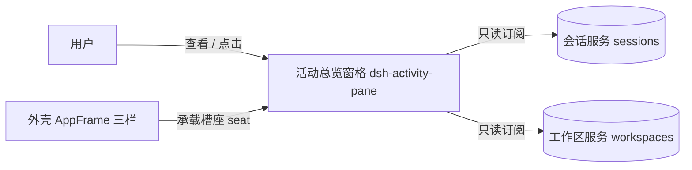
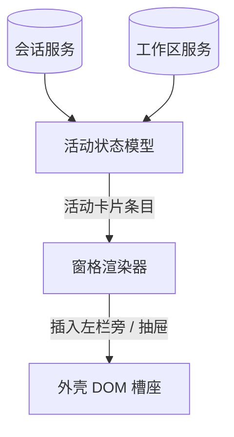
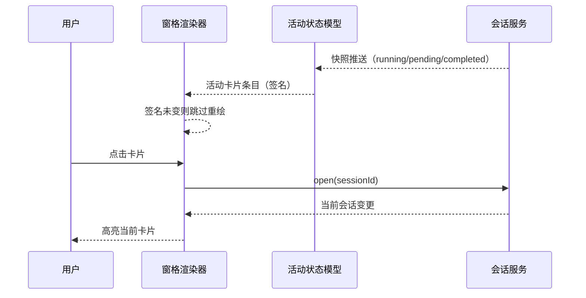

# DESIGN — 活动会话总览窗格

## 架构视图清单

| 视图 | 适用性/理由 | 图表位置 |
|---|---|---|
| 系统上下文 | 适用：窗格与用户、外壳三栏、会话/工作区服务存在明确边界 | 系统上下文图 |
| 一级静态分解 | 适用：需要说明两个主要运行单元（状态模型与渲染器）及其依赖 | 一级静态分解图 |
| 内部组件分解 | 不适用：两个单端 JS 模块，无更细的内部组件 | — |
| 运行时交互 | 适用：快照变化到卡片重绘、卡片激活到会话切换具有代表性时序 | 运行时交互图 |
| 数据与领域模型 | 不适用：活动条目是宿主快照的只读投影，无持久化模型 | — |
| 状态与生命周期 | 不适用：活动条目随快照整体派生，无独立持久状态机 | — |
| 数据流与信任边界 | 不适用：只读宿主会话快照，不处理敏感数据、不跨信任边界 | — |
| 部署 | 不适用：插件随宿主 web 打包分发，无可独立部署拓扑 | — |
| 分层与依赖 | 不适用：仅有单个浏览器 bundle，无分层约束 | — |
| 系统景观 | 不适用：单插件产品，不构成多系统平台 | — |

## 设计细化清单

| 关注面 | 适用性/理由 | 设计落点 |
|---|---|---|
| 边界与对外契约 | 适用：窗格与外壳 DOM、会话/工作区服务有明确契约 | DESIGN.md#边界与对外契约 |
| 核心数据与不变量 | 适用：活动条目模型与显示过滤是核心不变量 | DESIGN.md#核心数据与不变量 |
| 状态与生命周期 | 不适用：无独立持久状态，状态一律来自宿主快照 | — |
| 运行时、并发与失败语义 | 适用：渲染去重、打开重试与卸载清理有明确语义 | DESIGN.md#运行时、并发与失败语义 |
| 外部集成 | 不适用：除 DSH 会话/工作区服务外无外部集成 | — |
| 配置与可变点 | 不适用：v1 无用户可配置项，宽度与移动断点为代码常量 | — |
| 安全与信任边界 | 不适用：只读宿主快照，不处理敏感数据、不引入外部资源 | — |
| 部署、迁移与恢复 | 不适用：随宿主 web 打包分发，无独立部署/迁移语义 | — |
| 兼容性与版本演进 | 不适用：新项目无既有兼容契约，依赖外壳稳定槽座 | — |
| 可观测性与运维 | 不适用：无独立运行时可观测面，卸载可逆即恢复语义 | — |

## 实现就绪检查

| 条件 | 结论 | 证据或落点 |
|---|---|---|
| 边界与契约已明确 | 通过 | DESIGN.md#边界与对外契约 |
| 关键不变量已明确 | 通过 | DESIGN.md#核心数据与不变量 |
| 重大设计选择已收敛 | 通过 | C-001~C-003 已记入 DECISIONS.md |
| 目标实现归属已明确 | 通过 | DESIGN.md#子系统与模块 |
| 现状差距已有 task 承接 | 通过 | 运行卡向 answer-pet 富化（摘要/token/速率/进度/流程节点）由 T-002 承接（见 tasks/），已授权的目标差距 |
| 可派生验证 | 通过 | CONVENTIONS.md#验证门禁 |

## 静态架构

### 系统上下文图

### 一级静态分解图

## 运行时视图

### 运行时交互图

## 边界与对外契约

- 对外只读：窗格只消费 DSH 客户端服务 `sessions` 与 `workspaces` 的快照；不写回任何服务，不发起任何 HTTP 状态轮询（R-02-001、R-02-003）。
- 宿主依赖：窗口宿主为外壳三栏的中间列（`#root [data-slot="conversation"]` 的父级）。桌面下窗格作为该列内**真实的 flex 行元素**（插于会话座之前）占据左侧固定宽（默认 280px），会话根被设为 `flex:1 1 0%` 弹性填充余宽——主会话内容（标题/tabs/滚动区/输入框）随窗格展开随之让位、随折叠（窄条）同步恢复，而非被浮层覆盖（R-01-007、R-01-011）。
- 移动端：抽屉以 `position:fixed` 脱离文档流，不改变主会话布局；中间列恢复外壳默认列布局（R-01-008）。
- 页面契约：点击/键盘激活活动卡片 → 调用 `sessions.open` 切换当前会话；列表未就绪时以 `sessions.refresh` + 有限重试兜底（R-01-005）。
- 卸载契约：移除注入的窗格元素、浮动开关、样式与全部事件监听，复位对中间列/会话根的布局改写，不残留（R-02-003、R-02-004）。
- 关键机制：
  - 不依赖任何第三方宠物插件，也不向第三方数据路由发请求（R-02-001）。
  - 移动端抽屉不改变主会话布局，离开文档流（R-01-008）。
  - 双区结构：窗格内容区分为上「活动会话」下「最近历史」，两者都由同一快照派生；最近历史仅主会话（R-01-010）。
  - 轮内状态通过 `sessions.binding(sessionId).session` 订阅运行中会话取得，随运行结束断开；token/速率统计取 `sessions.list` 条目的 `projectionValues`（`tokenUsage` / `sessionStats`，复用既有列表订阅，无新增轮询）；运行时长与进度在渲染期按回合开始时间实时计算（R-01-009、R-02-004）。
  - 富卡统计：运行卡展示工具白名单参数摘要、输出 token/速率、阶段进度与最近流程节点轨迹；原始参数经 `summarizeToolArguments` 白名单过滤后再上卡（R-01-009）。
  - 桌面列提供折叠控制，折叠为不占正文宽度的窄条（R-01-011）。

## 核心数据与不变量

- 核心结构：`活动卡片条目 = { id, depth, kind: running|awaiting|subagent, title, workspaceTitle, isCurrent, pendingText? }`；`最近卡片条目 = { id, kind: 'recent', title, workspaceTitle, isCurrent, updatedAt }`。
- 显示过滤（核心不变量）：
  - 主会话显示当 `running || pendingInteraction || completed`；显示为 running 或 awaiting。
  - 子代理仅显示当 `running || pendingInteraction`；结束后即消失（R-01-001、R-01-003）。
  - 等待优先：存在待确认/待审查/待回复时以对应文案呈现；否则完成态以"需要响应"呈现（R-01-002）。
- 分区不变量：会话要么在活动区、要么在历史区，绝不同时出现；最近历史 = 当前非活动 && `updatedAt` 落在历史窗口（24h）内、**仅主会话（不含子代理）**，按最后活动时间倒序，最多 20 条（R-01-010）。
- 轮内状态输入：`statusLine({ runningTool, streaming, elapsedMs, outputTokens, rateTokS })` 为纯函数，输入由渲染器从原生 `ConversationSnapshot`（`runningCalls` / `partial` / `turnTimings` / `legacy.nodes`）与 `sessions.list` 条目的 `projectionValues`（`tokenUsage` / `sessionStats`）归一而来（R-01-009）。
- 排序不变量：主会话按所在工作区侧栏顺序；未纳入任何工作区的排在全部工作区之后并保持出现顺序；子代理跟随母会话并缩进（R-01-001、R-01-003）。
- 稳定签名：`cardSignature` 对条目可见字段求签名；签名相同的重复渲染必须跳过全部 DOM 写入（R-02-003）。

## 运行时、并发与失败语义

- 响应式渲染：订阅会话/工作区列表快照，任一变化即排队一次重绘；`cardSignature` 防止"渲染→写 DOM→再渲染"反馈循环（R-02-003）。
- 并发安全：重绘经 rAF/微任务合并，同一时刻至多进行一次；卡片按 id 复用，保证顺序稳定（R-01-004、R-02-003）。
- 轮内状态订阅：
  - 仅对运行中会话建立 `binding().session.subscribe`，随会话停止运行或插件卸载执行 `unsubscribe`，订阅数量与运行中会话一致（R-01-009、R-02-004）。
  - 订阅为推送式，各订阅在独立轻量回调中归一为 `{ runningTool, streaming, startTime }`；运行时长在渲染期按 `Date.now() - startTime` 实时计算（配合运行时钟逐秒刷新），不依赖推送事件更新（R-01-009/AC-03）。
- 失败语义：
  - 宿主元素未出现 → 静默等待探测，不报错（R-02-002）。
  - 点击目标未在列表就绪 → 轮询重试（固定时限内），超时结束本次交互、不影响其它卡片（R-01-005）。
  - 外壳重挂载移除窗格 → 观察者重新插入，且不产生重复实例（R-02-002）。
- 定时器纪律：仅在服务迟到时以短间隔探测获取 `sessions`/`workspaces`，就绪后停止；无数据轮询（R-02-001、R-02-004）。

## 需求追溯索引

| 需求 | 主责子系统 | 设计落点 | 实现位置 |
|---|---|---|---|
| R-01-001 | 活动状态模型 | 显示过滤与排序 | src/core.mjs |
| R-01-002 | 活动状态模型 | 等待文案与样式判定 | src/core.mjs |
| R-01-003 | 活动状态模型 | 层级嵌套与工作区归属 | src/core.mjs |
| R-01-004 | 窗格渲染器 | 可滚动列表 | src/client.mjs |
| R-01-005 | 窗格渲染器 | 卡片激活与跳转重试 | src/client.mjs |
| R-01-006 | 窗格渲染器 | 当前会话高亮 | src/client.mjs |
| R-01-007 | 窗格渲染器 | 桌面贴边列 | src/client.mjs |
| R-01-008 | 窗格渲染器 | 移动端抽屉与开关 | src/client.mjs |
| R-01-009 | 活动状态模型 | 轮内状态文案派生 | src/core.mjs、src/client.mjs |
| R-01-010 | 活动状态模型 | 双区派生与 24h 历史窗口 | src/core.mjs、src/client.mjs |
| R-01-011 | 窗格渲染器 | 桌面列折叠为窄条 | src/client.mjs |
| R-02-001 | 活动状态模型 | 独立数据源订阅 | src/core.mjs、src/client.mjs |
| R-02-002 | 窗格渲染器 | 重挂载恢复与静默等待 | src/client.mjs |
| R-02-003 | 活动状态模型 | 渲染签名与卸载清理 | src/core.mjs、src/client.mjs |
| R-02-004 | 窗格渲染器 | 轮内状态订阅生命周期 | src/client.mjs |

## 产品契约

- 活动卡片集合：`活动状态模型#buildEntries(snapshot, workspaceItems)` 产出已排序的活动卡片条目数组（R-01-001）。
- 最近历史集合：`活动状态模型#buildRecent(snapshot, workspaceItems, now)` 产出按最近活动时间倒序、容限 24h、上限 20 条的最近卡片（R-01-010）。
- 轮内状态文案：`活动状态模型#statusLine({ runningTool, streaming, elapsedMs, outputTokens, rateTokS })` 产出运行卡状态行（工具/流式/运行中 · token 计数 · 速率 · 时长）；渲染器从原生订阅快照与列表快照投影归一为输入（R-01-009）。
- 流程节点轨迹：`活动状态模型#buildTrace({ nodes, runningTool, runningArgs, streaming, reasoning, turnStartTime, now })` 产出最近少量流程节点（已定案工具调用 + 当前阶段），含 label/detail/status/durationMs；`summarizeToolArguments` 只从白名单字段提取摘要（R-01-009）。
- 阶段进度：`活动状态模型#progressOf({ phase, outputTokens, elapsedMs })` 产出 0–100 的估计百分比（tool 阶段冻结返回 null）；渲染层按回合叠加单调下限，保证同回合不倒退（R-01-009）。
- 等待文案：`pendingText(kind)` 将待确认/待审查/待回复归一为中文标识；完成态默认"需要响应"（R-01-002）。
- 层级结构：子代理经 `parentId` 关联并以 `depth` 表达缩进；子代理标题优先取目录 label，其次显示标题（R-01-003）。
- 窗口形态：桌面为左栏旁贴边列、可折叠为窄条；移动端（≤767px）为固定抽屉 + 浮动开关（R-01-007、R-01-008、R-01-011）。
- 交互面：点击或 Enter/Space 激活卡片 → 切换会话；当前会话卡片高亮（R-01-005、R-01-006）。

## 横切约束

- 安全呈现：任何会话标题/文本只经 `textContent` 写入，不走 HTML 拼接（防注入）。
- 角色纪律：窗格只读，不写回宿主；活动数据方向恒为 服务 → 卡片。
- 依赖边界：`src/core.mjs` 为纯函数（可 Node 单测），`src/client.mjs` 为浏览器 DOM 层。
- 归属约束：卡片视觉布局借鉴自 MIT 许可证的 dsh-answer-pet，保留来源声明（见 LICENSE 与 README）。

## 子系统与模块

### 活动状态模型
- 职责: 把宿主会话与工作区快照归一化为活动区/历史区条目与轮内状态文案（实现 R-01-001、R-01-002、R-01-003、R-01-009、R-01-010、R-02-001、R-02-003）
- 关键内部结构:
  - 纯函数、无 DOM、可单测。
  - 显示过滤单点实现：`isActiveRow`（buildEntries 的 show 与 buildRecent 共用），主会话/子代理分列，等待行动优先于运行态；`isSubagentRow` 判定直属子代理。
  - `buildRecent` 按 24h 历史窗口派生历史区（仅主会话、倒序、上限 20）。
  - `statusLine` 由归一化的轮内输入（工具/流式/时长/token/速率）产出运行卡状态文案。
  - 富卡辅助：`fmtTokens`、`summarizeToolArguments`（白名单）、`buildTrace`（流程节点轨迹）、`progressOf`（阶段进度）为运行卡提供纯函数派生。
  - 排序由工作区索引 + lineage 稳定序共同决定。
  - `cardSignature` 提供渲染去重签名。
- 代码位置: src/core.mjs
- 实现: 单端（JS，浏览器与 Node 共用同一份纯逻辑）

### 窗格渲染器
- 职责: 挂载窗格、双区绘制、独立滚动、卡片激活跳转、桌面折叠、移动端抽屉、轮内状态订阅生命周期与真实布局参与（实现 R-01-004、R-01-005、R-01-006、R-01-007、R-01-008、R-01-009、R-01-010、R-01-011、R-02-002、R-02-004）
- 关键内部结构:
  - 桌面下把中间列临时改为行方向，窗格作为真实 flex 行子项（先于会话座）占据左侧默认 280px；经祖先链（跳过 display:contents）找到会话根设 `flex:1 1 0%` 弹性填充，会话内容随之让位；折叠为窄条时让位同步恢复；仅桌面生效，移动端恢复外壳默认列布局。
  - 内容区为上「活动会话」下「最近历史」两段，各自带空态；由同一快照派生。
  - 卡片按 id 复用，配合签名去重避免无谓 DOM 写入。
  - 对每个运行中会话经 `sessions.binding(id).session` 订阅轮内状态，归一为 `statusLine` 输入；时长在渲染期按起始时间实时计算；停止运行或卸载即 `unsubscribe`。
  - 桌面列折叠为窄条 + 计数；移动端经媒体查询切为固定抽屉 + 浮动开关按钮。
  - 激活经几何命中 + capture 监听（限定窗格内部），配列表就绪重试。
- 代码位置: src/client.mjs
- 实现: 单端（浏览器 client bundle）
