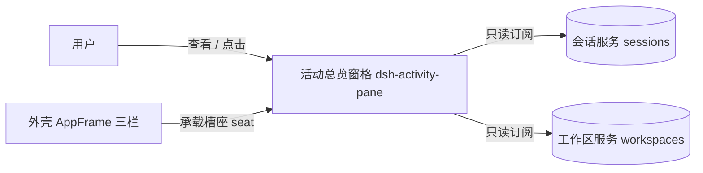
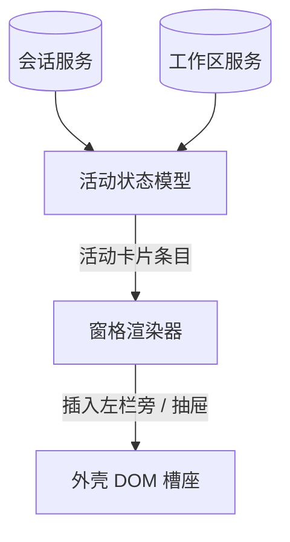
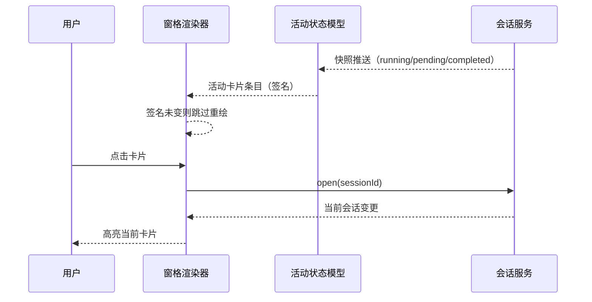

# DESIGN — 活动会话总览窗格

## 架构视图清单

| 视图 | 适用性/理由 | 图表位置 |
|---|---|---|
| 系统上下文 | 适用：窗格与用户、外壳三栏、会话/工作区服务存在明确边界 | 系统上下文图 |
| 一级静态分解 | 适用：需要说明两个主要运行单元（状态模型与渲染器）及其依赖 | 一级静态分解图 |
| 内部组件分解 | 不适用：两个单端 JS 模块，无更细的内部组件 | — |
| 运行时交互 | 适用：快照变化到卡片重绘、卡片激活到会话切换具有代表性时序 | 运行时交互图 |
| 数据与领域模型 | 不适用：活动条目是宿主快照的只读投影，无持久化模型 | — |
| 状态与生命周期 | 不适用：活动条目随快照整体派生，无独立持久状态机 | — |
| 数据流与信任边界 | 不适用：只读宿主会话快照，不处理敏感数据、不跨信任边界 | — |
| 部署 | 不适用：插件随宿主 web 打包分发，无可独立部署拓扑 | — |
| 分层与依赖 | 不适用：仅有单个浏览器 bundle，无分层约束 | — |
| 系统景观 | 不适用：单插件产品，不构成多系统平台 | — |

## 设计细化清单

| 关注面 | 适用性/理由 | 设计落点 |
|---|---|---|
| 边界与对外契约 | 适用：窗格与外壳 DOM、会话/工作区服务有明确契约 | DESIGN.md#边界与对外契约 |
| 核心数据与不变量 | 适用：活动条目模型与显示过滤是核心不变量 | DESIGN.md#核心数据与不变量 |
| 状态与生命周期 | 不适用：无独立持久状态，状态一律来自宿主快照 | — |
| 运行时、并发与失败语义 | 适用：渲染去重、打开重试与卸载清理有明确语义 | DESIGN.md#运行时、并发与失败语义 |
| 外部集成 | 不适用：除 DSH 会话/工作区服务外无外部集成 | — |
| 配置与可变点 | 适用：桌面列宽为用户可调（右缘拖拽 200–480px，localStorage 持久化）；移动断点仍为代码常量 | DESIGN.md#边界与对外契约 |
| 安全与信任边界 | 不适用：只读宿主快照，不处理敏感数据、不引入外部资源 | — |
| 部署、迁移与恢复 | 不适用：随宿主 web 打包分发，无独立部署/迁移语义 | — |
| 兼容性与版本演进 | 不适用：新项目无既有兼容契约，依赖外壳稳定槽座 | — |
| 可观测性与运维 | 不适用：无独立运行时可观测面，卸载可逆即恢复语义 | — |

## 实现就绪检查

| 条件 | 结论 | 证据或落点 |
|---|---|---|
| 边界与契约已明确 | 通过 | DESIGN.md#边界与对外契约 |
| 关键不变量已明确 | 通过 | DESIGN.md#核心数据与不变量 |
| 重大设计选择已收敛 | 通过 | C-001~C-003 已记入 DECISIONS.md |
| 目标实现归属已明确 | 通过 | DESIGN.md#子系统与模块 |
| 现状差距已有 task 承接 | 通过 | 运行卡向 answer-pet 富化（摘要/token/速率/进度/流程节点）由 T-002 承接（见 tasks/），已授权的目标差距 |
| 可派生验证 | 通过 | CONVENTIONS.md#验证门禁 |

## 静态架构

### 系统上下文图

### 一级静态分解图

## 运行时视图

### 运行时交互图

## 边界与对外契约

- 对外只读：窗格只消费 DSH 原生 `sessions` / `workspaces` 客户端服务及其 native `connection.api` 的一次性历史/模型读取；不写回任何服务，不发起第三方 HTTP 状态轮询（R-02-001、R-02-003）。
- 宿主依赖：窗口宿主为外壳三栏的中间列（`#root [data-slot="conversation"]` 的父级）。桌面下窗格作为该列内**真实的 flex 行元素**（插于会话座之前）占据左侧列宽（默认 280px，可经右缘手柄拖拽在 200–480px 内调整），会话根被设为 `flex:1 1 0%` 弹性填充余宽——主会话内容（标题/tabs/滚动区/输入框）随窗格展开与调宽随之让位、随折叠（窄条）同步恢复，而非被浮层覆盖（R-01-007、R-01-011、R-01-015）。
- 移动端：抽屉以 `position:fixed` 脱离文档流，不改变主会话布局；中间列恢复外壳默认列布局（R-01-008）。抽屉打开时显示透明全屏遮罩，z-index 介于主会话与抽屉之间，点击遮罩收起抽屉；遮罩完全透明、不占布局（R-01-008/AC-03）。浮动开关固定于会话头部左上角（`top:12px; left:44px`，即原生左边栏切换按钮右侧），文案为「活动」；抽屉打开时开关随之隐藏，关闭后恢复（R-01-008/AC-04、AC-05）。
- 页面契约：点击/键盘激活活动卡片 → 调用 `sessions.open` 切换当前会话；列表未就绪时以 `sessions.refresh` + 有限重试兜底（R-01-005）。
- 卸载契约：移除注入的窗格元素、浮动开关、透明遮罩、样式与全部事件监听，复位对中间列/会话根的布局改写，不残留（R-02-003、R-02-004）。
- 关键机制：
  - 不依赖任何第三方宠物插件，也不向第三方数据路由发请求（R-02-001）。
  - 移动端抽屉不改变主会话布局，离开文档流（R-01-008）。
  - 双区结构：窗格内容区分为上「活动会话」下「最近历史」，两者都由同一快照派生；最近历史仅主会话（R-01-010）。
  - 轮内状态通过 `sessions.binding(sessionId).session` 订阅运行中会话取得，随运行结束断开；token/速率统计取 `sessions.list` 条目的 `projectionValues`（`tokenUsage` / `sessionStats`，复用既有列表订阅，无新增轮询）；运行时长与进度在渲染期按回合开始时间实时计算（R-01-009、R-02-004）。
  - 工作项数据优先从原生 `ConversationSnapshot.chat` 的 `order` / `nodes` 读取，按主会话窗口显示顺序取尾部 4 项；冷会话使用 native `sessions.history` 读取补齐：尾页取不到最近用户/agent 消息时按 `beforeSeq` 向前有界深翻（最多 3 页，找到或翻尽即止），不克隆第三方 UI 路由。运行中当前项由原生 `session.subscribe` 推送刷新（R-01-012）。
  - 模型上下文从 native `sessions.models` 的当前选择与 catalog metadata 归一，模型名称与 reasoning level 缺失时保持空值；不使用 `agentPreset` 冒充模型（R-01-012）。
  - 富卡统计：运行卡展示工具动作摘要、输出 token/速率与阶段进度；动作摘要由 `summarizeToolArguments` 按主会话窗口同一语义派生（分工具类型参数键、bash 含 command、无命中取首个字符串参数值、剥离工作区前缀、取首行）后上卡（R-01-009）。
  - 运行卡外观沿用 answer-pet 的卡片质感。
    - 工作项时间线从卡片内容左边界起步，竖线与圆点严格同圆心；当前节点圆点带半透明外环并闪烁。
    - 进度条为 5px 圆角；流式阶段内部显示经 `data-streaming` 驱动的向右滚动条纹。
    - 卡片不渲染独立当前动作状态行。
    - 工作项标题与摘要之间显示小圆点；用户项使用人物图标。
    - 错误项保留动作图标并将图标、动作文字与摘要染为错误红色；Bash 使用稳定的原生 API 图标，不读取展开态下的 disclosure 箭头（R-01-009/AC-02、AC-08、AC-09；R-01-012/AC-03～AC-08）。
  - 桌面列折叠以「活动会话」标题行整体为控件：展开态激活标题行折叠为不占正文宽度的窄条；折叠态标题行隐藏，窄条以竖排标题「活动会话」+ 活动计数呈现并整体可点展开；两种状态下手柄均占据窗格顶部同一位置；移动端断点下不提供标题行收起交互（R-01-011）。
  - 桌面列右缘叠加拖拽手柄：拖拽实时写入 `--dap-width` 并夹取在 200–480px；调宽结果存 localStorage，启动时读取恢复，缺失/非法值回退默认 280px、越界值夹取进范围；折叠窄条与移动端抽屉不显示手柄（R-01-015）。

## 核心数据与不变量

- 核心结构：`活动卡片条目 = { id, parentId?, depth, kind: running|awaiting|subagent|parent, title, workspaceTitle, model, reasoning, timeline, isCurrent, pendingText? }`；`parent` 表示自身非活动但因后代活动而显示的活动层级上下文；`最近卡片条目 = { id, kind: 'recent', title, workspaceTitle, model, reasoning, userPreview, agentPreview, isCurrent, updatedAt }`。
- 显示过滤（核心不变量）：
  - 主会话显示当自身 `running || pendingInteraction || completed`，或存在活动后代；自身不活动但存在活动后代时显示为 `parent` 活动层级上下文，否则显示为 running 或 awaiting。
  - 子代理显示当自身 `running || pendingInteraction`，或存在活动后代；自身不活动但存在活动后代时显示为 `parent` 上下文，既无自身活动也无活动后代时结束并消失（R-01-001、R-01-003）。
  - 等待优先：存在待确认/待审查/待回复时以对应文案呈现；否则完成态以"需要响应"呈现（R-01-002）。
- 分区不变量：会话要么在活动区、要么在历史区，绝不同时出现；最近历史 = 当前非活动 && `updatedAt` 落在历史窗口（24h）内、**仅主会话（不含子代理）**，按最后活动时间倒序，最多 20 条（R-01-010）。
- 轮内状态输入：`runtimeStats({ elapsedMs, outputTokens, rateTokS })` 与 `conversationTimeline(snapshot)` 为纯函数，输入由渲染器从原生 `ConversationSnapshot`（`chat` / `runningCalls` / `partial` / `turnTimings` / `legacy.nodes`）与 `sessions.list` 条目的 `projectionValues`（`tokenUsage` / `sessionStats`）归一而来（R-01-009、R-01-012）。
- 排序不变量：主会话按所在工作区侧栏顺序；未纳入任何工作区的排在全部工作区之后并保持出现顺序；活动层级上下文与子代理均跟随母会话并缩进（R-01-001、R-01-003）。
- 稳定签名：`cardSignature` 对条目可见字段求签名（含 model/reasoning/timeline/userPreview/agentPreview、progress/streaming/tokenStats）；签名相同的重复渲染必须跳过全部 DOM 写入（R-02-003）。
- 运行卡渲染期字段：渲染器为 running 条目补充 `progress`（阶段百分比）、`timeline`（主会话窗口最近工作项）、`streaming`（流式阶段标记，驱动 `data-streaming` 属性与进度条条纹动画）与 `tokenStats`；不再派生独立 `status` 文案行；同一 `kind` 卡片的 DOM 骨架在 `streaming` 翻转时经签名重绘更新属性。

## 运行时、并发与失败语义

- 响应式渲染：订阅会话/工作区列表快照，任一变化即排队一次重绘；`cardSignature` 防止"渲染→写 DOM→再渲染"反馈循环（R-02-003）。工作项时间线与消息预览按快照/历史引用 memo（引用不变即命中缓存），`conversationTimeline`/`messagePreviews` 自尾部反向扫描、取够目标条数即停，长会话不做全序扫描；会话区 DOM 行索引每次渲染构建一次供当次全部工作项共用。
- 宿主 DOM 观察：槽座迟到由 body `MutationObserver` 通知唤醒；绑定后 center → body 的祖先链逐级以 `childList` 观察，任一级断裂（含高于 parent 的视图级重挂载）即重装并恢复窗格；center 只观察直接子节点处理 seat/center 重挂载，conversation seat 子树只观察流式 `childList` 变化，插件 pane 子树不进入观察范围（R-02-002、R-02-003）。
- 并发安全：重绘经 rAF/微任务合并，同一时刻至多进行一次；卡片按 id 复用，保证顺序稳定（R-01-004、R-02-003）。
- 轮内状态订阅：
  - 仅对运行中会话建立 `binding().session.subscribe`，随会话停止运行或插件卸载执行 `unsubscribe`，订阅数量与运行中会话一致（R-01-009、R-02-004）。
  - 订阅为推送式，各订阅在独立轻量回调中归一为 `{ runningTool, streaming, startTime }`；运行时长在渲染期按 `Date.now() - startTime` 实时计算（配合运行时钟逐秒刷新），不依赖推送事件更新（R-01-009/AC-03）。
- 失败语义：
  - 宿主元素未出现 → 由 body `MutationObserver` 静默等待，不报错、不使用探测定时器（R-02-002）。
  - 点击目标未在列表就绪 → 仅在用户点击触发后限时重试，超时结束本次交互、不影响其它卡片；重试链在目标已成为当前会话、用户激活其它卡片或任一打开成功时立即取消，避免过期跳转把当前会话拽回旧目标（R-01-005）。
  - 外壳重挂载移除窗格 → 观察者重新插入，且不产生重复实例（R-02-002）。
- 定时器纪律：不使用服务发现/frame probe 或数据状态轮询；仅保留运行中可见时长的单一 1 秒时钟，以及用户点击触发的有限重试（R-02-001、R-02-004）。
- 加载状态模型（R-01-014）：
  - 列表级：`listLoadState` 把列表快照归一为 loading/ready（快照缺失或 `phase === "pending"` 为在途）；loading 时活动区/历史区各显示活动图标，禁止空态冒充（宿主契约：empty-with-ready 才是真无会话）。
  - 卡片字段级：models/history/`session.open()` 在途时，模型区、时间线区、预览行显示行内加载指示（spinner）；数据返回经签名驱动就地填充，不重建卡片。
  - 渐进呈现：补充数据逐个 promise 完成即重绘（先就绪先显示，不等待全部）；注册新读取后立即重绘一次让指示出现。
  - 并发池：冷读取（models/history）经队列并发上限 3 发出，优先级为当前会话最优先、活动区先于历史区、区内按显示顺序；卸载清空队列。
  - 失败语义：补充数据失败降级为空字段；记账随可见性清理放行，会话重回可见时允许重试（R-01-014/AC-05）。
  - 加载状态并入 `cardSignature`（loadingModel/loadingTimeline/loadingPreviews），指示翻转经签名去重重绘。

## 需求追溯索引

| 需求 | 主责子系统 | 设计落点 | 实现位置 |
|---|---|---|---|
| R-01-001 | 活动状态模型 | 显示过滤与排序 | src/core.mjs |
| R-01-002 | 活动状态模型 | 等待文案与样式判定 | src/core.mjs |
| R-01-003 | 活动状态模型 | 层级嵌套与工作区归属 | src/core.mjs |
| R-01-004 | 窗格渲染器 | 可滚动列表 | src/client.mjs |
| R-01-005 | 窗格渲染器 | 卡片激活与跳转重试 | src/client.mjs |
| R-01-006 | 窗格渲染器 | 当前会话高亮 | src/client.mjs |
| R-01-007 | 窗格渲染器 | 桌面贴边列 | src/client.mjs |
| R-01-008 | 窗格渲染器 | 移动端抽屉与开关 | src/client.mjs |
| R-01-009 | 活动状态模型 | 轮内状态文案派生 | src/core.mjs、src/client.mjs |
| R-01-010 | 活动状态模型 | 双区派生与 24h 历史窗口 | src/core.mjs、src/client.mjs |
| R-01-011 | 窗格渲染器 | 标题行整体折叠控件 | src/client.mjs |
| R-01-015 | 窗格渲染器 | 桌面右缘拖拽调宽与持久化 | src/core.mjs、src/client.mjs |
| R-01-012 | 活动状态模型 | 原生会话工作项、模型上下文与实时快照 | src/core.mjs、src/client.mjs |
| R-01-013 | 窗格渲染器 | 最近卡五行信息层级、角色图标与 hover | src/core.mjs、src/client.mjs |
| R-02-001 | 活动状态模型 | 独立数据源订阅 | src/core.mjs、src/client.mjs |
| R-02-002 | 窗格渲染器 | 重挂载恢复与静默等待 | src/client.mjs |
| R-02-003 | 活动状态模型 | 渲染签名与卸载清理 | src/core.mjs、src/client.mjs |
| R-02-004 | 窗格渲染器 | 轮内状态订阅生命周期 | src/client.mjs |
| R-01-014 | 窗格渲染器 | 加载状态模型与渐进呈现 | src/core.mjs、src/client.mjs |

## 产品契约

- 活动卡片集合：`活动状态模型#buildEntries(snapshot, workspaceItems)` 产出已排序的活动卡片条目数组（R-01-001）。
- 最近历史集合：`活动状态模型#buildRecent(snapshot, workspaceItems, now)` 产出按最近活动时间倒序、容限 24h、上限 20 条的最近卡片（R-01-010）。
- 轮内状态数据：`活动状态模型#runtimeStats({ runningTool, streaming, elapsedMs, outputTokens, rateTokS })` 产出运行卡所需的时长、token 与速率字段；当前动作不再单独输出为卡片状态行，工具名、回复文本与详情进入 `工作项时间线`（R-01-009/AC-01、AC-02、AC-03、AC-05）。
- 工作项时间线呈现：`活动状态模型#conversationTimeline` 产出的工作项含 label/summary/status；时间线不显示行级耗时，对齐主会话窗口工作项行（原生无行级耗时，C-012）；工具项详情经 `summarizeToolArguments` 镜像主会话窗口 `deriveSummary` 语义（R-01-009/AC-07、R-01-012）。
  - 渲染层以竖线串圆点的时间线呈现：轨道从卡片内容左边界起步，竖线与圆点严格同圆心（整数像素位，避免 1px 竖线分数位吸附偏移）；竖线穿过首个节点圆点并向上引出，终点没入最新动作圆点内部不外露。
  - 圆点带半透明外环；正在执行节点使用蓝色外环并闪烁，已定案节点使用绿/红实心圆点；圆点位于内容区，不被容器裁切。
  - 会话运行中（快照 `running === true` 且 `pending` 为空）、时间线无 live 工作项且无其他执行中项时，`conversationTimeline` 将尾部已定案的非用户工作项克隆提升为 `running`，作为 agent 工作中的持续标志；尾部为 error/stopped/用户输入项时不提升；渲染层经 `mergeTraceStatus` 合并工作项状态，核心派生的 `running` 优先于原生行 `data-state`，核心非 running 时保持原生优先旧语义（R-01-009/AC-10）。
  - 工作项渲染优先读取原生 `iconIdle` 中的动作图标，排除 hover/open disclosure 箭头与错误 `StateDot`；用户项使用人物 SVG。
  - 非当前会话或原生行缺失时，fallback 使用与主网页同一张 canonical 图标表（按 toolName 镜像原生 classifyTool 与行级覆盖，未知工具按 view.kind 语义兜底）与 canonical 动作标题，选中/非选中态不漂移（R-01-012/AC-03）。
  - fallback 文字镜像原生 keyed 行：`TOOL_LABELS` 含 todo_write「更新任务清单」与 ask_user_question「提问」；todo 摘要复刻「done/total 已完成 · 当前活动项」、ask 摘要复刻「等待回答 / 已答 x/y / 已取消 / 已中断」状态文案，错误态摘要取结果输出首行；Think/context 原生行按工作项身份匹配，不共用首个同类行（R-01-012/AC-03）。
  - Bash 无论状态/展开态均使用稳定的原生 API 图标；错误项只改变图标与标题/摘要颜色，不替换图标；标题和摘要之间插入 2px 圆形分隔符（R-01-009/AC-09、R-01-012/AC-03～AC-08）。
- 阶段进度：`活动状态模型#progressOf({ phase, outputTokens, elapsedMs })` 产出 0–100 的估计百分比（tool 阶段冻结返回 null）；渲染层按回合叠加单调下限，保证同回合不倒退；首观测即 tool 阶段（中途接入）以思考基线兜底防 0（R-01-009/AC-06）。渲染层以 5px 圆角进度条呈现，流式阶段（`data-streaming`）填充为向右滚动条纹动画（R-01-009/AC-08）。
- 最近卡消息预览行：第三行（最近用户消息首行）文本前常驻人物图标（与工作项时间线的用户语义一致）、第四行（最近 agent reply 首行）文本前常驻机器人图标；文本缺失时仅显示图标，文本与加载指示写入图标后的独立文本段（R-01-013/AC-03、AC-04、AC-07、AC-08）。
- 等待文案：`pendingText(kind)` 将待确认/待审查/待回复归一为中文标识；完成态默认"需要响应"（R-01-002）。
- 层级结构：子代理经 `parentId` 关联并以 `depth` 表达缩进；子代理标题优先取目录 label，其次显示标题；渲染层在缩进槽内绘制母会话到直属子代理的层级连接线（R-01-003/AC-01、AC-04）。
- 窗口形态：桌面为左栏旁贴边列，可经「活动会话」标题行整体折叠为窄条（窄条竖排标题 + 计数，整条可点展开）；移动端（≤767px）为固定抽屉 + 左上角浮动开关（文案「活动」，抽屉打开时隐藏）（R-01-007、R-01-008、R-01-011）。桌面列宽可经右缘手柄拖拽在 200–480px 内调整，拖拽实时生效并令主会话弹性让位，结果存 localStorage 于启动时恢复（R-01-015）。
- 交互面：点击或 Enter/Space 激活卡片 → 切换会话；当前会话卡片高亮（R-01-005、R-01-006）。

## 横切约束

- 安全呈现：任何会话标题/文本只经 `textContent` 写入，不走 HTML 拼接（防注入）。
- 角色纪律：窗格只读，不写回宿主；活动数据方向恒为 服务 → 卡片。
- 依赖边界：`src/core.mjs` 为纯函数（可 Node 单测），`src/client.mjs` 为浏览器 DOM 层。
- 归属约束：卡片视觉布局借鉴自 MIT 许可证的 dsh-answer-pet，保留来源声明（见 LICENSE 与 README）。

## 子系统与模块

### 活动状态模型
- 职责: 把宿主会话与工作区快照归一化为活动区/历史区条目、工作项时间线、模型上下文与消息预览（实现 R-01-001、R-01-002、R-01-003、R-01-009、R-01-010、R-01-012、R-01-013、R-02-001、R-02-003）
- 关键内部结构:
  - 纯函数、无 DOM、可单测。
  - 显示过滤单点实现：`activeSessionIds` 沿活动会话的 `parentId` 链补齐所有活动祖先，`isActiveRow` 供 buildEntries/buildRecent 共用；`isSubagentRow` 判定直属子代理，`parent` 条目只承载层级上下文，不建立轮内订阅。
  - `buildRecent` 按 24h 历史窗口派生历史区（仅主会话、倒序、上限 20），并归一化 workspace/model/reasoning、最近用户首行与 agent 首行。
  - `conversationTimeline` 从原生 ChatSnapshot 的实际 order 提取最近 4 个工作项，保留图标语义、文字、详情与状态；运行中无 live 项时按 R-01-009/AC-10 将尾部非用户已定案项提升为 running；`firstPhysicalLine` 只取消息的第一个非空物理行。
  - `modelMetadata` 从 native models response 提取当前模型名称与 reasoning level；缺失值保持空白。
  - 富卡辅助：`fmtTokens`、`summarizeToolArguments`（镜像原生 `deriveSummary` 语义）、`progressOf`（阶段进度）、`runtimeStats`（时长/token/速率）为运行卡提供纯函数派生。
  - 排序由工作区索引 + lineage 稳定序共同决定。
  - `cardSignature` 提供渲染去重签名；`trackRuns` 把活动条目压成母会话轨道运行（每个拥有可见直属子代理的母会话一条：全部可见直属子代理 id 与子级深度；直属性按母会话条目深度+1 判定，无 id 或非直属条目跳过）；`trackBoxes` 由测量矩形推导全部绘制盒并统一取整到 CSS 像素（竖轨：母会话底缘 → 末级子卡中心含收口行；横线：竖轨右缘 → 子卡左缘），供渲染层整体绘制。
- 代码位置: src/core.mjs
- 备注: 宽度夹取纯函数 `clampPaneWidth`（200–480px，非法输入回退默认 280px）亦属本模块，供渲染层拖拽与启动恢复共用（R-01-015/AC-02、AC-04）。
- 实现: 单端（JS，浏览器与 Node 共用同一份纯逻辑）

### 窗格渲染器
- 职责:
  - 窗格结构与交互：挂载窗格、双区绘制、独立滚动、卡片激活跳转、桌面折叠、移动端抽屉、真实布局参与（实现 R-01-004、R-01-005、R-01-006、R-01-007、R-01-008、R-01-011）
  - 内容呈现与加载：轮内状态订阅生命周期、加载状态模型与渐进呈现、重挂载自愈（实现 R-01-009、R-01-010、R-01-012、R-01-013、R-01-014、R-02-002、R-02-004）
  - 桌面调宽：右缘拖拽手柄实时调宽、范围夹取与 localStorage 持久化（实现 R-01-015）
- 关键内部结构:
  - 桌面下把中间列临时改为行方向，窗格作为真实 flex 行子项（先于会话座）占据左侧默认 280px；经祖先链（跳过 display:contents）找到会话根设 `flex:1 1 0%` 弹性填充，会话内容随之让位；折叠为窄条时让位同步恢复；仅桌面生效，移动端恢复外壳默认列布局。
  - 内容区为上「活动会话」下「最近历史」两段，各自带空态；由同一快照派生。
  - `parent` 活动层级上下文卡片显示母会话本身，保持层级顺序但不显示自身运行时间线，也不建立轮内状态订阅（R-01-003/AC-05）。
  - 活动区子代理卡片沿 `depth` 缩进；母会话到直属子代理的连接线由列表内轨道层（`.dap-tracks`）按测量值整体绘制：每条竖轨一个连续元素、零拼接接缝，横线同为轨道层元素，全部坐标统一取整（同相位、粗细一致、端点相接）；连接线不覆盖卡片内容或点击区域（R-01-003/AC-04）。
  - 卡片按 id 复用，流程节点按稳定 id 复用 DOM；配合签名去重避免无谓 DOM 写入，并保持运行节点脉冲动画连续。
  - 最近卡两条消息预览行为「角色图标 + 文本」双段结构：用户消息行人物图标、agent 回复行机器人图标，图标常驻；文本与加载 spinner 只写入文本段，不覆盖图标（R-01-013/AC-07、AC-08）。
  - 对每个运行中会话经 `sessions.binding(id).session` 订阅轮内状态与 ChatSnapshot，归一为 `runtimeStats` 与工作项时间线；时长在渲染期按起始时间实时计算；停止运行或卸载即 `unsubscribe`。冷会话只通过 native history/model 的一次性读取补齐，不进行状态轮询。
  - 运行卡外观对齐 answer-pet。
    - CSS 实现动作时间线（从卡片内容左边界起步、竖线 + 圆点半透明外环 + 运行节点闪烁）与进度条（5px、流式 `data-streaming` 条纹动画）。
    - 工作项标题与摘要之间渲染小圆点；错误项通过 `data-status="error"` 将保留的动作 SVG、标题和摘要染红。
    - `prefers-reduced-motion` 仅关闭填充宽度 transition，不关闭状态脉冲/流式条纹；`streaming` 字段并入稳定签名以驱动属性翻转重绘。
  - 桌面列折叠：`.dap-header` 标题行整体作为收起/展开控件（`role="button"` + `tabindex` + `aria-expanded`，click 与 Enter/Space 激活，仅桌面断点生效；hover 高亮、`cursor: pointer` 与行尾方向符号 « 表达可点，方向符号是行的一部分而非独立按钮）；折叠态隐藏标题行、显示窄条，窄条内竖排（`writing-mode: vertical-rl`）显示「活动会话」与计数徽标，整条可点展开；原 header 内独立 « 按钮移除；移动端 × 关闭钮阻止冒泡、不触发折叠（R-01-011）；移动端经媒体查询切为固定抽屉 + 浮动开关按钮（固定于会话头部左上角 `top:12px; left:44px`，左边栏切换按钮右侧，文案「活动」，R-01-008/AC-04）。
  - 桌面调宽手柄：右缘 6px 命中区，`pointerdown` 后经 `setPointerCapture` 跟踪 `pointermove` 实时写入 `--dap-width`（经核心 `clampPaneWidth` 夹取 200–480px，拖拽期间经 rAF 合帧派发 resize 通知），`pointerup`/`pointercancel` 持久化 localStorage；折叠窄条态与移动断点下经 CSS 隐藏手柄；卸载移除手柄与监听（R-01-015）。
  - 抽屉开合状态经 `togglePane` 单点写入，同步 `data-open`、透明遮罩显隐与浮动开关显隐（抽屉打开时开关隐藏、关闭恢复，R-01-008/AC-05）；遮罩为 `position:fixed` 透明层（z-index 介于主会话与抽屉之间），点击经 `bindBackdropDismiss` 收起抽屉；触摸轻点经浏览器 tap→click 合成事件覆盖（与 ×/卡片交互一致，仅绑 click，不额外绑 touch 事件避免双触发与滑动误收起）；桌面断点外由媒体查询直接隐藏，无需 JS 断点监听（R-01-008/AC-03）。
  - 每张 card 在创建时注册自身的 `click` / `keydown` handler，直接读取当前 card 的 `data-session-id`；外部菜单与 pane 空白不进入卡片处理，配列表就绪重试。
- 代码位置: src/client.mjs
- 实现: 单端（浏览器 client bundle）
