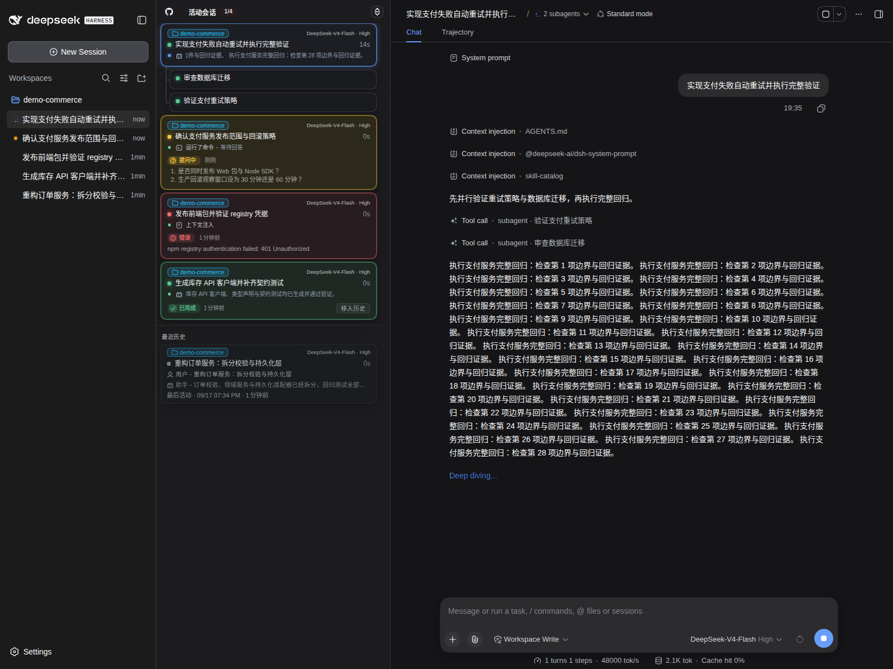

# dsh-activity-pane

DSH (DeepSeek Harness) 一大痛点是缺少活动会话与历史会话的管理，重度用户在同时运行跨越多个工作区的多个会话时，无法一目了然的掌控全局，尤其当 DSH 原生左边栏工作区的会话积累过多之后，活动会话的信息过于分散，无法解答以下问题：
- 现在有多少个会话在并行跑？
- 哪些会话启动了子代理甚至孙代理会话？它们有多少？
- 每个会话现在正在做什么？它们的进度如何？跑了多长时间？
- 每个会话使用什么模型？什么推理级别？输出tps是多少？
- 哪些会话的agent轮次最近刚结束，需要我响应？
- 过去一段时间我在哪些会话里交互过？最近的指令与结论是什么？
- ...

本插件试图解决这些问题，提供了一个**活动会话总览窗格**：将正在运行的会话、子会话、轮次完成等待响应的会话、近期活跃过的历史会话，集中在一个窗格内进行整体展示。

  

## 感谢与声明

- 本项目灵感来自 [`dsh-answer-pet`](https://github.com/Nanki-nn/dsh-answer-pet) 插件，借鉴了其中会话卡片的设计思路，并按自己的使用习惯与喜好做了调整与重新实现，感谢原作者的创意！
- 本项目代码与文档 99.99% 由 AI 编写与审核，大概率存在 bug 与文档/代码不同步等问题，使用中如遇到问题请提交 issue。

## 相比 dsh-answer-pet 的调整

- [x] **从浮层改为固定窗格**：桌面版本在左边栏工作区的右侧增加了一个常驻窗格，移动版本在左侧增加了一个滑动抽屉。
- [x] **去除宠物图标功能**：不支持宠物相关功能，界面聚焦于会话活动本身。
- [x] **原生数据源订阅**：直接订阅 DSH 原生 `sessions` / `workspaces` 服务的推送式快照，时间线显示最近 4 条活动内容。
- [x] **增加历史会话列表**：窗格分为「活动会话」和「最近历史」两个区域，非活动主会话在最近 24 小时内仍可快速找回。
- [x] **强化等待响应提醒**：会话轮次结束后保留卡片并高亮提醒用户响应。
- [x] **显示子/孙会话层级**：运行中的子代理以紧凑卡片嵌套在母会话下，结束后自动消失；历史区只保留主会话。
- [x] **显示工作区名称并参与排序**：会话卡片显示所属工作区名称，会话排序与左侧边栏中的工作区顺序保持一致。
- [x] **加入会话导航跳转**：点击会话卡片可跳转到对应会话页面。
- [x] **增加会话元信息**：会话卡片中显示当前使用的模型名称和推理级别。
