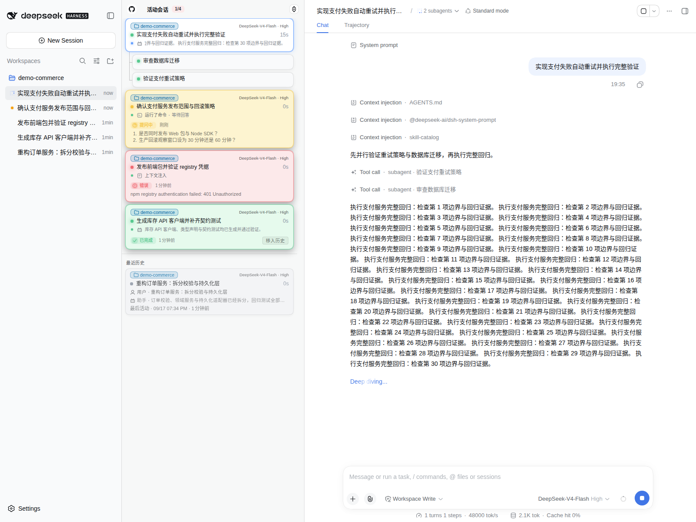

# dsh-activity-pane

English | [简体中文](README.zh-CN.md)

One of the pain points of DSH (DeepSeek Harness) is the lack of management for active and historical sessions. Heavy users who run multiple sessions across multiple workspaces at the same time have no way to take in the whole picture at a glance. In particular, once sessions pile up in DSH's native left-sidebar workspaces, the information about active sessions becomes so scattered that it can no longer answer questions like:
- How many sessions are running in parallel right now?
- Which sessions have spawned sub-agents or even grandchild sub-agents, and how many are there?
- What is each session doing right now? What is its progress? How long has it been running?
- Which model and reasoning level does each session use? What are its output rate, cache hit rate, and token usage?
- Which sessions have just finished an agent round and are waiting for my action?
- Which sessions have I interacted with recently? What were the latest instructions and conclusions?
- ...

This plugin attempts to answer these questions by providing an **activity session overview pane**: running sessions, sub-sessions, sessions waiting for action after finishing a round, and recently active past sessions are brought together and presented as a whole in a single pane.

<p align="center">
  <picture>
    <source media="(prefers-color-scheme: dark)" srcset="assets/screenshot-desktop-dark.png">
    
  </picture>
</p>
<p align="center"><sub>Mobile <a href="assets/screenshot-mobile-dark.png">dark drawer</a> · <a href="assets/screenshot-mobile-light.png">light drawer</a> of the same clean isolated environment running a simulated coding task</sub></p>

## Install

```sh
dsh plugin --profile web add dsh-activity-pane
```

The npm package ships prebuilt, so no local build step is needed. If the pane does not appear after installing, restart `dsh web` once.

## Requirements

- DSH (DeepSeek Harness) web, tested against `@deepseek-ai/dsh@0.1.0-rc.7`.
- No third-party plugin dependencies: the pane only consumes DSH's native session and workspace services, and uninstalling is fully reversible.

## Acknowledgments & Disclaimers

- This project was inspired by the [`dsh-answer-pet`](https://github.com/Nanki-nn/dsh-answer-pet) plugin: it borrows the session-card design idea, adjusted and re-implemented to fit my own usage habits and preferences. Many thanks to the original author for the creativity!
- The grouping semantics of the collapsed timeline are adapted from the MIT-licensed [`dsh-auto-collapse`](https://github.com/a179-sanae/dsh-auto-collapse) plugin (a data-layer port with no runtime dependency). Thanks to the original author.
- The agent-role bot icons on the timeline body rows and recent cards adopt the geometry of the ISC-licensed [Lucide](https://lucide.dev) `bot` icon. Thanks to the Lucide contributors.
- 99.99% of this project's code and documentation was written and reviewed by AI, so bugs and doc/code drift are quite likely. If you run into any problems, please open an issue.

## Adjustments Compared to dsh-answer-pet

> This project began as a personal re-take on [`dsh-answer-pet`](https://github.com/Nanki-nn/dsh-answer-pet), so the checklist below is phrased as a comparison against it — if you have never used that plugin, simply read it as the feature list.

- [x] **From floating overlay to docked pane**: on desktop, a persistent edge-docked column is added to the right of the left-sidebar workspaces; on mobile, a fixed drawer hidden by default is expanded via the "Activity" button in the session header, without squeezing the main conversation layout.
- [x] **No pet icon features**: pet-related features are not supported; the UI focuses on session activity itself.
- [x] **Native data-source subscription**: directly subscribes to the push snapshots of DSH's native `sessions` / `workspaces` services; the timeline shows at most 4 collapsed work-item rows, keeping the latest user instruction and the work item actually being executed.
- [x] **Recent session list**: the pane is split into "Active sessions" and "Recent history" areas; inactive main sessions are shown in activity-time batches, and a "Load more..." button at the bottom lets users explicitly reveal older sessions.
- [x] **Stronger waiting-for-action reminders**: blocked waits, completion reminders, and error reminders are marked with gold, green, and red cards respectively; questions are previewed directly as a question list, and completion reminders are explicitly acknowledged via the "Move to history" button on the card; the state is persisted on the host side and synced across all clients, so refreshing the page or opening another window never loses unacknowledged completion reminders or error reminders not yet overwritten by a new round.
- [x] **Sub/grandchild session hierarchy**: sub-agents are nested under their parent session with connector lines and compact cards; a parent whose own round has ended but that still has active descendants keeps rendering as running, and disappears from the active area once its sub-agents have ended and no active descendants remain; the history area keeps main sessions only.
- [x] **Workspace names displayed and factored into ordering**: session cards show a workspace badge with a stable color, and session ordering follows the workspace order in the left sidebar.
- [x] **Current work and run stats**: active cards show the latest instruction, thinking, and tool calls in a collapsed timeline of at most 4 rows; running cards also show round progress, output rate, cache hit rate, input/output tokens, and run duration, while completed, blocked, and error waits retain the previous round's duration and last-known output stats; recent history cards retain the latest completed round's available stats between the reply preview and activity time.
- [x] **Session navigation**: clicking or keyboard-activating a session card jumps to that session's page, and the current session stays highlighted.
- [x] **Session metadata**: session cards show the current model name and reasoning level.
- [x] **Polished desktop & mobile interactions**: the desktop pane can collapse, be resized by dragging, and remember its width; mobile uses a fixed drawer that does not squeeze the main conversation layout; long lists get independent scrolling and a back-to-top button.

## License

MIT — see [LICENSE](LICENSE) for the full text.
